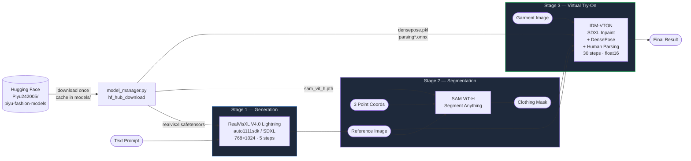
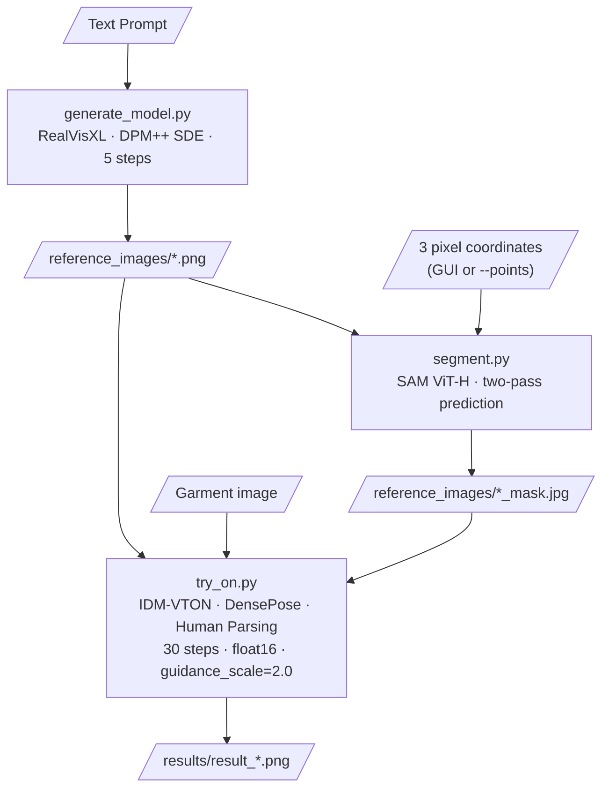

<div align="center">

# AI Clothing Fashion Design Generator

**Text to fashion model. Segment. Try on. All in one pipeline.**

Generate photorealistic human fashion models from text prompts, isolate clothing regions with SAM, and apply new garments using IDM-VTON — with a Streamlit web interface and Hugging Face model storage.

[](https://python.org)
[](https://pytorch.org)
[](https://github.com/huggingface/diffusers)
[](https://streamlit.io)
[](https://huggingface.co/Piyu242005/piyu-fashion-models)
[](LICENSE)
[](https://github.com/yisol/IDM-VTON)
[](https://developer.nvidia.com/cuda-toolkit)

</div>

---

## Table of Contents

- [Overview](#overview)
- [Production Architecture](#production-architecture)
- [Key Features](#key-features)
- [System Architecture](#system-architecture)
- [End-to-End Workflow](#end-to-end-workflow)
- [Tech Stack](#tech-stack)
- [Project Structure](#project-structure)
- [Installation](#installation)
- [Hugging Face Model Setup](#hugging-face-model-setup)
- [Environment Variables](#environment-variables)
- [Usage — CLI](#usage--cli)
- [Usage — Streamlit App](#usage--streamlit-app)
- [Running on Google Colab](#running-on-google-colab)
- [Hardware Requirements](#hardware-requirements)
- [Limitations](#limitations)
- [Troubleshooting](#troubleshooting)
- [License & Model Licenses](#license--model-licenses)
- [Future Improvements](#future-improvements)
- [Security](#security)
- [Contributing](#contributing)
- [Acknowledgements](#acknowledgements)
- [Author](#author)

---

## Overview

The **AI Clothing Fashion Design Generator** is a three-stage generative AI pipeline that takes a text description of a clothing style and produces a fully rendered virtual try-on result. It is designed to run on a GPU server, draw model weights from a Hugging Face model repository, and present results through a Streamlit web interface.

**Stage 1 — Generation.** [`generate_model.py`](generate_model.py) uses **RealVisXL V4.0 Lightning** (SDXL-based) via the `auto1111sdk` library to generate a photorealistic human figure at 768×1024 with DPM++ SDE in 5 steps.

**Stage 2 — Segmentation.** [`segment.py`](segment.py) loads **SAM ViT-H** and accepts either an interactive GUI (local desktop) or pre-specified pixel coordinates (headless / Colab / Streamlit) to produce a binary clothing mask.

**Stage 3 — Virtual Try-On.** [`try_on.py`](try_on.py) runs **IDM-VTON** — an SDXL inpainting pipeline from `yisol/idm_vton` — using DensePose body estimation and human parsing to seamlessly composite a new garment into the masked region at float16 precision.

All model weights are managed by [`model_manager.py`](model_manager.py), which downloads and caches them from a Hugging Face model repository using `hf_hub_download()`. No weight files are committed to this repository.

---

## Production Architecture

```
GitHub (this repository)
         │ code
         ▼
   Streamlit UI (app.py)
         │ function calls
         ▼
   GPU Server / Google Colab
   ┌──────────────────────────────────┐
   │  model_manager.py                │
   │     ↓ hf_hub_download()          │
   │  Hugging Face                    │
   │  Piyu242005/piyu-fashion-models  │
   │     ↓ cached locally in models/  │
   │  generate_model.py  (RealVisXL)  │
   │  segment.py         (SAM ViT-H)  │
   │  try_on.py          (IDM-VTON)   │
   └──────────────────────────────────┘
         │ result image
         ▼
   Final virtual try-on output
```

**Hugging Face is the model warehouse, not the compute.** It stores large weight files and serves them on demand. The GPU machine runs all inference.

---

## Key Features

| Feature | Description |
|---|---|
| **Text-to-Model Generation** | RealVisXL V4.0 Lightning generates a 768×1024 photorealistic portrait from a clothing-style text prompt |
| **Interactive Segmentation** | SAM ViT-H segments the clothing region; accepts three GUI clicks (local) or three pixel coordinates (headless/Streamlit) |
| **SDXL Virtual Try-On** | IDM-VTON's dual-UNet SDXL inpainting pipeline composites a garment image into the masked region at float16 |
| **DensePose Conditioning** | Estimates 3D body surface geometry to guide garment placement and warping |
| **Human Parsing** | ATR/LIP ONNX models parse body regions to assist garment compositing |
| **Hugging Face Model Storage** | All weight files are stored in `Piyu242005/piyu-fashion-models` and downloaded on demand via `hf_hub_download()` — no weights in this repo |
| **Streamlit Web UI** | Two-mode interface: *Generate & Try-On* (text → model → garment) and *Try-On Only* (upload photo → garment) |
| **Cached Model Loading** | `@st.cache_resource` ensures models are loaded once per server process, not per user click |
| **Headless Segmentation** | `segment.py --points` skips the interactive GUI for server and Colab environments |
| **Reproducible Outputs** | `--seed` parameter in both `try_on.py` and the Streamlit UI |

---

## System Architecture



---

## End-to-End Workflow



**Stage 1** — `generate_model.py` calls `StableDiffusionPipeline` from `auto1111sdk`, loading RealVisXL V4.0 Lightning from the local cache. The user's clothing description is embedded in a standardised portrait prompt and inference runs at `cfg_scale=2`, `steps=5`, DPM++ SDE.

**Stage 2** — `segment.py` loads SAM ViT-H on CUDA. Locally, a Matplotlib GUI opens and waits for three point clicks. For headless environments, pass `--points x1,y1,x2,y2,x3,y3`. A two-pass SAM prediction (multi-mask → best logit → refined single mask) produces the binary clothing mask, saved as `*_mask.jpg`.

**Stage 3** — `try_on.py` must run from inside the `idm_vton/` directory (cloned separately). It downloads and loads the full IDM-VTON SDXL pipeline from `yisol/idm_vton` on Hugging Face. At inference time, DensePose estimates a body geometry pose image, then the dual-UNet inpainting pipeline runs for 30 steps at float16 with `guidance_scale=2.0`.

---

## Tech Stack

### Generative AI

| Model / Library | Role |
|---|---|
| [RealVisXL V4.0 Lightning](https://civitai.com/models/139562) | Text-to-image generation of realistic human fashion models |
| [IDM-VTON](https://github.com/yisol/IDM-VTON) (`yisol/idm_vton`) | SDXL-based dual-UNet virtual garment try-on |
| [Segment Anything (SAM)](https://github.com/facebookresearch/segment-anything) | Point-prompted, zero-shot clothing region segmentation |
| [auto1111sdk](https://github.com/Auto1111sdk/auto1111sdk) | Python SDK wrapper for Stable Diffusion inference |

### Framework & Inference

| Library | Version | Role |
|---|---|---|
| [PyTorch](https://pytorch.org) | 2.1.0 | Core deep learning framework |
| [Diffusers](https://github.com/huggingface/diffusers) | 0.25.0 | SDXL pipeline, DDPMScheduler, AutoencoderKL |
| [Transformers](https://github.com/huggingface/transformers) | 4.30.2 | CLIP encoders, tokenizers |
| [huggingface_hub](https://github.com/huggingface/huggingface_hub) | ≥0.20.0 | `hf_hub_download()` for model weight management |
| [Detectron2](https://github.com/facebookresearch/detectron2) | source | DensePose body estimation |
| [onnxruntime](https://onnxruntime.ai) | 1.16.2 | Human parsing inference (ATR/LIP ONNX models) |

### UI & Utilities

| Library | Role |
|---|---|
| [Streamlit](https://streamlit.io) ≥1.32.0 | Web UI with two-mode pipeline interface |
| [python-dotenv](https://github.com/theskumar/python-dotenv) | `.env` file support for `HF_TOKEN` and config |
| OpenCV | Image I/O and colour conversion |
| Pillow 9.5.0 | Image loading and saving |
| NumPy 1.23.5 | Array operations, mask processing |
| Matplotlib | Interactive segmentation GUI (local desktop) |

---

## Project Structure

```text
Piyu-AI-Clothing-Fashion-Design-Generator/
│
├── app.py                 # Streamlit web UI — two-mode pipeline interface
├── model_manager.py       # HF model download/cache layer (hf_hub_download)
├── generate_model.py      # Stage 1: text-to-image with RealVisXL via auto1111sdk
├── segment.py             # Stage 2: clothing segmentation with SAM ViT-H
├── try_on.py              # Stage 3: virtual try-on with IDM-VTON
│
├── requirements.txt       # Python dependencies (includes streamlit, huggingface_hub)
├── .env.example           # Environment variable template (copy to .env)
├── LICENSE                # MIT License
├── .gitignore             # Excludes weights/, models/, .env, idm_vton/, generated images
│
├── reference_images/      # Generated human model images and their masks
│   └── .gitkeep           # Directory placeholder (actual images excluded by .gitignore)
│
├── samples/               # Input garment images for try-on
│   ├── garment.png
│   └── sample_image.jpg
│
└── results/               # Final virtual try-on outputs
    └── .gitkeep           # Directory placeholder (actual images excluded by .gitignore)
```

**What is NOT in this repository** (excluded by `.gitignore`):

```text
weights/          ← RealVisXL .safetensors, SAM .pth
models/           ← downloaded weight cache (managed by model_manager.py)
idm_vton/         ← cloned separately from github.com/yisol/IDM-VTON
.env              ← your HF_TOKEN and config (never commit this)
results/*.png     ← generated output images
```

---

## Installation

### Prerequisites

| Requirement | Details |
|---|---|
| Python | 3.8 or higher |
| NVIDIA GPU | Required — all models run on CUDA |
| VRAM | 16 GB minimum; 24 GB recommended |
| CUDA | 11.8 or 12.1 |
| Disk | ~25–30 GB free for models + environment |
| Git | For cloning this repo and IDM-VTON |

### 1. Clone the Repository

```bash
git clone https://github.com/Piyu242005/Piyu-AI-clothing-fashion-design-generator.git
cd Piyu-AI-clothing-fashion-design-generator
```

### 2. Create a Virtual Environment

**Linux / macOS**
```bash
python3 -m venv venv && source venv/bin/activate
```

**Windows**
```powershell
python -m venv venv; .\venv\Scripts\activate
```

### 3. Install PyTorch (CUDA wheel first)

```bash
pip install torch==2.1.0 torchvision --index-url https://download.pytorch.org/whl/cu118
```

### 4. Install Python Dependencies

```bash
pip install --upgrade pip
pip install -r requirements.txt
```

### 5. Install Detectron2 and Segment Anything (from source)

```bash
pip install 'git+https://github.com/facebookresearch/detectron2.git'
pip install 'git+https://github.com/facebookresearch/segment-anything.git'
```

### 6. Clone IDM-VTON

```bash
git clone https://github.com/yisol/IDM-VTON.git idm_vton
cp try_on.py idm_vton/
```

> `try_on.py` uses relative imports (`src/`, `utils_mask`, `apply_net`, `preprocess/`) that exist inside the IDM-VTON repository. It must be run from inside `idm_vton/`.

---

## Hugging Face Model Setup

All model weights are stored in the Hugging Face repository **`Piyu242005/piyu-fashion-models`** and are downloaded automatically by `model_manager.py` on first run. No manual `wget` commands are required.

### Repository structure on Hugging Face

```text
Piyu242005/piyu-fashion-models
│
├── realvisxl/
│   └── realvisxl.safetensors          (~6 GB)
│
├── sam/
│   └── sam_vit_h_4b8939.pth           (~2.5 GB)
│
└── idm_vton/
    ├── densepose/
    │   └── model_final_162be9.pkl     (~245 MB)
    │
    ├── humanparsing/
    │   ├── parsing_atr.onnx           (~80 MB)
    │   └── parsing_lip.onnx           (~80 MB)
    │
    └── openpose/
        └── body_pose_model.pth        (~200 MB)
```

> The IDM-VTON SDXL pipeline weights (`yisol/idm_vton`) are fetched automatically from the original Hugging Face repository by `try_on.py` on first run (~8–10 GB additional download).

### Uploading weights to your own Hugging Face repository

If you need to upload the weights yourself (e.g. after downloading them in Colab):

```python
from huggingface_hub import HfApi, login

login()   # enter your HF token when prompted — do NOT hardcode it

api = HfApi()

# Upload RealVisXL
api.upload_file(
    path_or_fileobj="/path/to/realvisxl.safetensors",
    path_in_repo="realvisxl/realvisxl.safetensors",
    repo_id="Piyu242005/piyu-fashion-models",
    repo_type="model",
)

# Upload SAM
api.upload_file(
    path_or_fileobj="/path/to/sam_vit_h_4b8939.pth",
    path_in_repo="sam/sam_vit_h_4b8939.pth",
    repo_id="Piyu242005/piyu-fashion-models",
    repo_type="model",
)

# Upload DensePose checkpoint
api.upload_file(
    path_or_fileobj="/path/to/model_final_162be9.pkl",
    path_in_repo="idm_vton/densepose/model_final_162be9.pkl",
    repo_id="Piyu242005/piyu-fashion-models",
    repo_type="model",
)

# Repeat for parsing_atr.onnx, parsing_lip.onnx, body_pose_model.pth
```

> **License check before uploading.** Verify the redistribution terms of RealVisXL (CivitAI/Stability AI community license) and IDM-VTON (CC BY-NC-SA 4.0) before making your model repository public. See [License & Model Licenses](#license--model-licenses).

---

## Environment Variables

Copy `.env.example` to `.env` and fill in your values. **Never commit `.env` to source control.**

```bash
cp .env.example .env
```

`.env.example`:

```bash
# Hugging Face access token — required for private or access-gated repositories
HF_TOKEN=your_huggingface_token_here

# Hugging Face model repository ID
HF_REPO_ID=Piyu242005/piyu-fashion-models

# Local directory where weights are cached after download (default: models/)
MODEL_DIR=models
```

Set tokens in shell (alternative to `.env`):

```bash
# Linux / macOS
export HF_TOKEN="your_token_here"

# Windows PowerShell
$env:HF_TOKEN = "your_token_here"
```

---

## Usage — CLI

On first run of any script, `model_manager.py` will download the required weights from Hugging Face and cache them in `models/`. Subsequent runs skip the download.

### Step 1 — Generate the Human Fashion Model

```bash
python generate_model.py \
  --prompt "a crop top and mini skirt" \
  --output_path "reference_images/crop_top.png"
```

Additional examples:
```bash
python generate_model.py --prompt "a maxi dress with cut out details" --output_path "reference_images/dress.png"
python generate_model.py --prompt "A formal jumpsuit with a belt" --output_path "reference_images/jumpsuit.png"
```

### Step 2 — Generate the Clothing Mask

**Local desktop (interactive GUI):**
```bash
python segment.py --input "reference_images/crop_top.png"
```
A Matplotlib window opens. Click three points on the clothing region. The mask is saved as `reference_images/crop_top_mask.jpg`.

**Headless / server / Colab:**
```bash
python segment.py \
  --input "reference_images/crop_top.png" \
  --points "384,300,400,450,360,500"
```
Provide three `x,y` pixel coordinates (six comma-separated integers) to skip the GUI entirely.

### Step 3 — Virtual Try-On

Run from inside `idm_vton/` (required for relative imports):

```bash
cd idm_vton

python try_on.py \
  --reference_image "../reference_images/crop_top.png" \
  --mask            "../reference_images/crop_top_mask.jpg" \
  --garment         "../samples/garment.png" \
  --cloth_type      "crop top" \
  --output_path     "../results/result_crop_top.png" \
  --denoise_steps   30 \
  --seed            42
```

| Argument | Description |
|---|---|
| `--reference_image` | Generated human model image (Stage 1 output) |
| `--mask` | Binary clothing mask (Stage 2 output) |
| `--garment` | Target garment image to apply |
| `--cloth_type` | Text description used in the inpainting prompt |
| `--output_path` | Where to save the final result |
| `--denoise_steps` | DDPM denoising steps (default: 30) |
| `--seed` | Random seed for reproducibility (default: 42) |

---

## Usage — Streamlit App

```bash
streamlit run app.py
```

The app provides two modes accessible from the sidebar:

**Mode 1 — Generate & Try-On**
1. Enter a clothing description → click **Generate Model** → RealVisXL generates the human figure.
2. Note three pixel coordinates on the clothing region in the generated image.
3. Upload a garment image and enter the pixel coordinates → click **Apply Garment**.
4. SAM segments the region, IDM-VTON applies the garment, result is displayed with a download button.

**Mode 2 — Try-On Only**
1. Upload an existing person photo and a garment image.
2. Enter a cloth type description and three pixel coordinates on the clothing region.
3. Click **Apply Garment** → result is displayed with a download button.

> Models are loaded once via `@st.cache_resource` and reused across all user interactions. The first load triggers the Hugging Face downloads.

---

## Running on Google Colab

For development and testing without a local GPU, use a GPU-enabled Colab environment.

### Setup

**1. Enable GPU runtime**

`Runtime → Change runtime type → Hardware accelerator → T4 GPU` (or A100 for Colab Pro).

**2. Verify CUDA**

```python
!nvidia-smi
```

**3. Clone and install**

```python
!git clone https://github.com/Piyu242005/Piyu-AI-clothing-fashion-design-generator.git
%cd Piyu-AI-clothing-fashion-design-generator

!pip install torch==2.1.0 torchvision --index-url https://download.pytorch.org/whl/cu118
!pip install -r requirements.txt
!pip install 'git+https://github.com/facebookresearch/detectron2.git'
!pip install 'git+https://github.com/facebookresearch/segment-anything.git'

!git clone https://github.com/yisol/IDM-VTON.git idm_vton
!cp try_on.py idm_vton/
```

**4. Set your Hugging Face token**

```python
import os
os.environ["HF_TOKEN"] = "your_token_here"   # or use Colab Secrets
```

**5. Run the pipeline**

`generate_model.py` and `try_on.py` run in Colab without modification.

For `segment.py`, use headless mode with `--points` (the interactive Matplotlib GUI requires a desktop display):

```python
!python segment.py \
    --input "reference_images/crop_top.png" \
    --points "384,300,400,450,360,500"
```

**6. Run the Streamlit app in Colab**

```python
!pip install pyngrok
from pyngrok import ngrok
!streamlit run app.py --server.port 8501 &
public_url = ngrok.connect(8501)
print(public_url)
```

> **Colab storage note:** The T4 provides ~100 GB temporary disk. Model weights (~25 GB total) are lost when the session disconnects. Store weights on Google Drive or use `hf_hub_download()` to re-fetch from Hugging Face at the start of each session.

---

## Hardware Requirements

| Component | Recommendation |
|---|---|
| GPU | NVIDIA GPU with CUDA support (T4, RTX 3080, A100, etc.) |
| VRAM | 16 GB minimum; 24 GB recommended |
| RAM | 16 GB system RAM minimum |
| Disk | 25–30 GB free for models + environment |
| CUDA | 11.8 or 12.1 |
| Python | 3.8 or higher |
| OS | Linux (recommended), macOS, Windows |

---

## Limitations

- **GPU required.** All three pipeline stages use CUDA. CPU inference is not supported in the current implementation.
- **Large model downloads.** First-run downloads total approximately 25 GB across all weight files. Hugging Face caching avoids repeat downloads.
- **VRAM pressure.** Loading the full IDM-VTON dual-UNet SDXL pipeline at float16 is memory-intensive. Run each stage as a separate process to avoid accumulating models in VRAM.
- **Manual or coordinate-based segmentation.** Clothing region selection requires either three GUI clicks (local) or three pixel coordinates (headless). Incorrect coordinates produce poor masks and degrade try-on quality.
- **Try-on quality depends on input quality.** IDM-VTON performs best with clean, well-lit reference images and flat-lay or mannequin garment images at 768×1024.
- **Streamlit segmentation workaround.** The interactive Matplotlib GUI cannot run inside a Streamlit process; the app uses the `--points` coordinate input approach instead.
- **IDM-VTON directory dependency.** `try_on.py` must be executed from inside `idm_vton/` due to relative module imports (`src/`, `utils_mask`, `apply_net`, `preprocess/`).
- **Colab session limits.** Model weights stored in Colab's temporary filesystem are lost on session disconnect.
- **Fixed resolution.** The pipeline operates at 768×1024. Other resolutions require script modifications.
- **IDM-VTON license restriction.** The IDM-VTON checkpoints are CC BY-NC-SA 4.0 — non-commercial use only.

---

## Troubleshooting

### CUDA not detected

```bash
nvidia-smi
python -c "import torch; print(torch.cuda.is_available(), torch.version.cuda)"
```

If `False`, reinstall PyTorch with the correct CUDA wheel:
```bash
pip install torch==2.1.0 torchvision --index-url https://download.pytorch.org/whl/cu118
```

---

### Out of GPU memory

- Run each stage in a separate Python invocation rather than importing all models in the same process.
- Restart the Python process / Colab runtime between stages to clear VRAM.
- Use an A100 Colab runtime (Colab Pro) for more headroom.

---

### Hugging Face model download fails

Verify your token is set correctly:
```python
from huggingface_hub import HfApi
api = HfApi()
api.whoami()   # should return your username
```

If the repository requires authentication:
```bash
pip install huggingface_hub
huggingface-cli login
```

---

### IDM-VTON import errors (`src.tryon_pipeline`, `utils_mask`, `apply_net`)

These modules live inside the IDM-VTON clone. Ensure `try_on.py` is inside `idm_vton/` and run from there:

```bash
cd idm_vton
python try_on.py ...
```

---

### DensePose checkpoint not found

`model_manager.py` expects the DensePose checkpoint at `idm_vton/densepose/model_final_162be9.pkl` (resolved via `get_densepose_paths()`). Verify the `MODEL_DIR` environment variable and that the download completed:

```bash
python -c "from model_manager import get_densepose_paths; print(get_densepose_paths())"
```

---

### Segmentation window does not open

`segment.py` opens a Matplotlib GUI that requires a desktop display. On headless machines or Colab, use the `--points` argument:

```bash
python segment.py --input "reference_images/crop_top.png" --points "384,300,400,450,360,500"
```

---

## License & Model Licenses

### This repository

Licensed under the **MIT License** — see [LICENSE](LICENSE).

### Underlying model licenses

| Model | License | Notes |
|---|---|---|
| **IDM-VTON** (code & checkpoints) | [CC BY-NC-SA 4.0](https://github.com/yisol/IDM-VTON/blob/main/LICENSE) | Non-commercial use only; attribution required; adaptations must share alike |
| **RealVisXL V4.0 Lightning** | [CivitAI / Stability AI community terms](https://civitai.com/models/139562) | Review before redistribution or commercial use |
| **Segment Anything (SAM)** | Apache 2.0 | Copyright © Meta Platforms, Inc. |
| **Detectron2** | Apache 2.0 | Copyright © Facebook, Inc. |
| **Diffusers / Transformers** | Apache 2.0 | Copyright © Hugging Face |

> **Important:** For any use of this project in a non-academic, commercial, or public context, review the IDM-VTON and RealVisXL licenses carefully. The IDM-VTON CC BY-NC-SA 4.0 license restricts commercial use of the model checkpoints. Attribute the original IDM-VTON authors in any publication or project derived from this work.

---

## Future Improvements

The following are planned and have **not yet been implemented**.

### Phase 1 — Core Robustness
- Automatic clothing region segmentation (eliminate manual coordinate input)
- Input validation and error handling in all three pipeline scripts
- Central configuration file for all model paths and inference parameters

### Phase 2 — Interface
- In-browser interactive segmentation (replace coordinate text input with image-click UI)
- Support for upper body, lower body, and full-body garment categories
- Batch processing for multiple garments or model images

### Phase 3 — Capability
- Text-guided garment generation (design a garment from a description, then apply it)
- Style and colour transfer controls
- Support for user-uploaded person photos in the Generate & Try-On mode

### Phase 4 — Deployment
- Separate Streamlit frontend from GPU inference backend via REST API
- Persistent GPU backend (RunPod, Modal, or cloud GPU server)
- User project history and virtual wardrobe
- Export pipeline for social media aspect ratios

---

## Security

- **Never commit model weights.** `.gitignore` excludes `*.safetensors`, `*.pth`, `*.pkl`, `*.onnx`, `*.bin`, `weights/`, `models/`.
- **Never commit `.env`.** `.gitignore` excludes `.env` and `.env.*`. Use `.env.example` as a template.
- Store your Hugging Face token in an environment variable or Colab Secrets — never hardcode it in any script.
- If you use `huggingface-cli login` on a shared machine, clear the stored token when done: `huggingface-cli logout`.

---

## Contributing

1. **Fork** the repository.
2. **Create a branch**: `git checkout -b feature/your-feature-name`
3. **Make changes.** Keep commits focused on a single change.
4. **Test all three pipeline stages** before opening a PR.
5. **Commit**: `git commit -m "feat: describe your change"`
6. **Push**: `git push origin feature/your-feature-name`
7. **Open a Pull Request** against `main` with a clear description.

---

## Acknowledgements

- **[IDM-VTON](https://github.com/yisol/IDM-VTON)** — Choi et al., ECCV 2024. Core virtual try-on pipeline. CC BY-NC-SA 4.0.
- **[Segment Anything (SAM)](https://github.com/facebookresearch/segment-anything)** — Meta AI Research. Interactive and zero-shot image segmentation.
- **[RealVisXL V4.0 Lightning](https://civitai.com/models/139562)** — High-realism SDXL human generation model.
- **[Diffusers](https://github.com/huggingface/diffusers)** — Hugging Face. SDXL pipeline infrastructure.
- **[Detectron2](https://github.com/facebookresearch/detectron2)** — Meta AI Research. DensePose body estimation.
- **[auto1111sdk](https://github.com/Auto1111sdk/auto1111sdk)** — Python SDK for Stable Diffusion inference.
- **[huggingface_hub](https://github.com/huggingface/huggingface_hub)** — `hf_hub_download()` for model weight management.

---

## Author

**Piyush Ramteke**

GitHub: [github.com/Piyu242005](https://github.com/Piyu242005)

---

<div align="center">
  <sub>AI Clothing Fashion Design Generator &nbsp;·&nbsp; MIT License &nbsp;·&nbsp; IDM-VTON: CC BY-NC-SA 4.0 (non-commercial)</sub>
</div>
