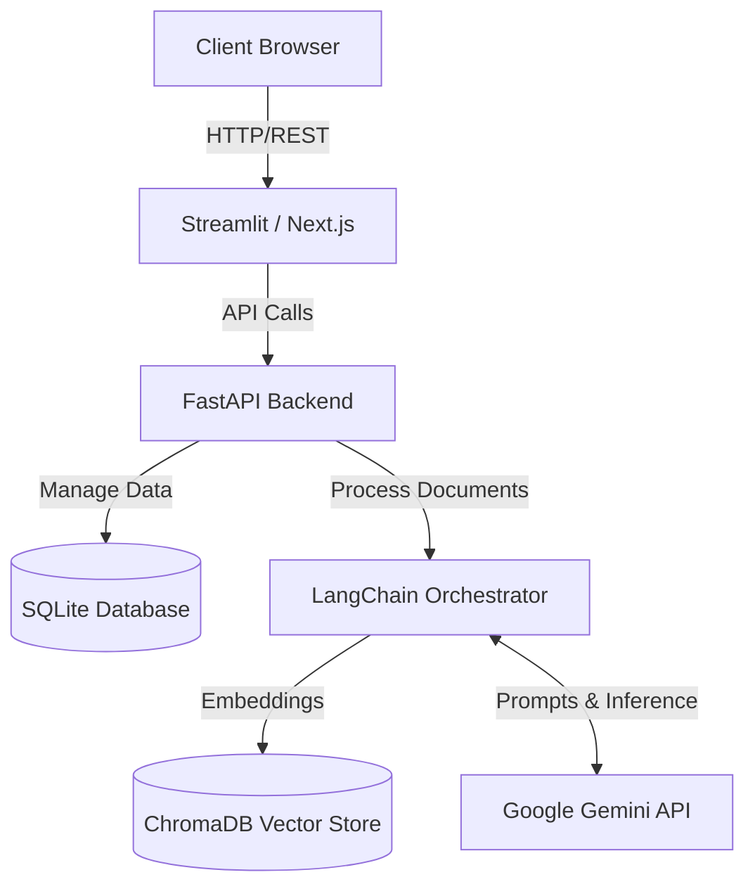
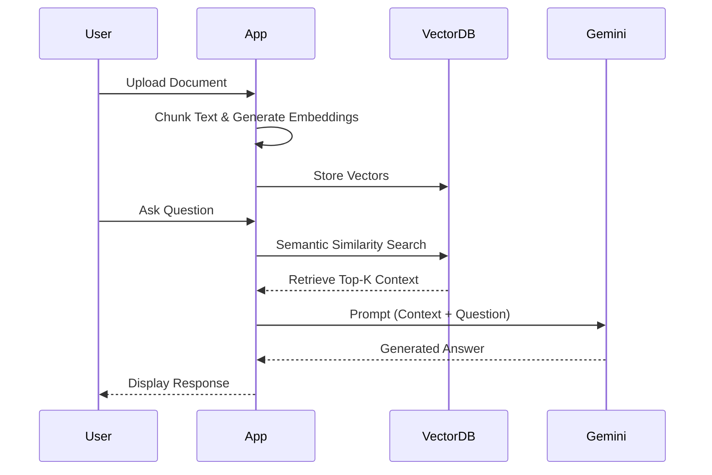
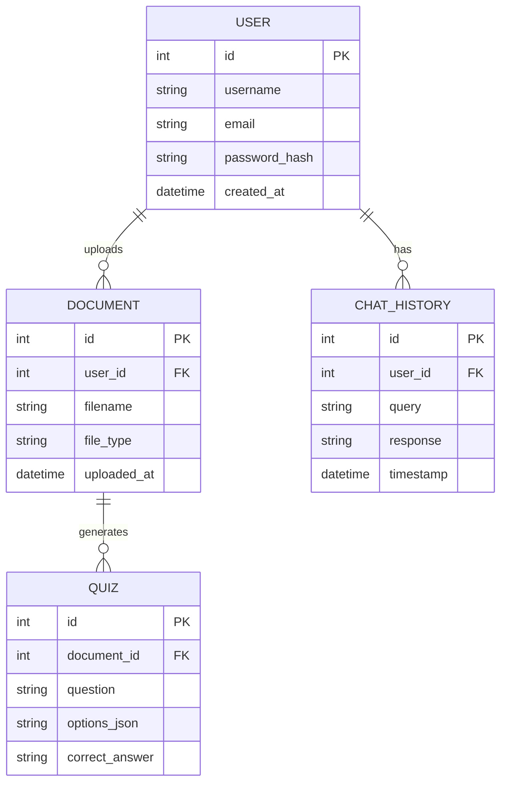

<div align="center">

# 🧠 AI-Powered Study Buddy

**The Ultimate AI-Driven Learning Companion for Students and Professionals**

[](https://www.python.org/)
[](https://fastapi.tiangolo.com/)
[](https://streamlit.io/)
[](https://deepmind.google/technologies/gemini/)
[](https://langchain.com/)
[](https://opensource.org/licenses/MIT)

<br/>

<!-- Banner Placeholder -->


<br/>

<!-- Demo GIF Placeholder -->


</div>

---

## 📑 Table of Contents
<details>
<summary>Click to expand</summary>

- [Project Overview](#-project-overview)
- [Features](#-features)
- [Screenshots](#-screenshots)
- [Architecture](#-architecture)
- [Technology Stack](#-technology-stack)
- [Folder Structure](#-folder-structure)
- [Installation](#-installation)
- [Running Locally](#-running-locally)
- [API Endpoints](#-api-endpoints)
- [AI Workflow](#-ai-workflow)
- [Database Schema](#-database-schema)
- [Project Workflow](#-project-workflow)
- [UML Diagrams](#-uml-diagrams)
- [Performance & Security](#-performance--security)
- [Evaluation Metrics](#-evaluation-metrics)
- [Future Roadmap](#-future-roadmap)
- [Deployment Guide](#-deployment-guide)
- [Testing](#-testing)
- [Documentation](#-documentation)
- [Contributing](#-contributing)
- [License](#-license)
- [Acknowledgements](#-acknowledgements)
- [Contact](#-contact)

</details>

---

## 📖 Project Overview

**AI-Powered Study Buddy** is an advanced generative AI application designed to revolutionize the learning experience. By leveraging **Retrieval-Augmented Generation (RAG)**, it enables students to upload course materials (PDF, DOCX, PPT, TXT) and interact with them intelligently. Powered by **Google Gemini** and **LangChain**, the system generates comprehensive summaries, interactive quizzes, dynamic flashcards, and personalized study recommendations.

Targeted towards students, AI engineers, and educators, this project demonstrates enterprise-level implementation of Large Language Models (LLMs) to solve real-world educational challenges.

> [!NOTE]
> This project was developed as part of the **IBM SkillsBuild Internship 2026** and showcases production-grade AI integration, robust backend architecture, and a scalable data pipeline.

---

## ✨ Features

| Feature | Description | Status |
|:---|:---|:---:|
| 📄 **Intelligent Document Processing** | Upload PDFs, DOCX, PPT, and TXT files. Extracts and chunks content seamlessly. | ✅ |
| 💬 **Conversational AI (RAG)** | Ask contextual questions about your study materials and get precise answers. | ✅ |
| 📝 **Automated Summarization** | Generate concise, bulleted summaries of lengthy chapters or papers. | ✅ |
| 🎯 **Quiz Generation** | Automatically create multiple-choice questions (MCQs) to test knowledge. | ✅ |
| 🗂️ **Dynamic Flashcards** | Generate spaced-repetition ready flashcards for active recall. | ✅ |
| 📈 **Personalized Recommendations** | Receive tailored study paths based on quiz performance and interactions. | 🚧 |
| 🔒 **Enterprise Security** | Built-in prompt injection protection and hallucination reduction. | ✅ |

---

## 📸 Screenshots

<details>
<summary><b>View Application Interface</b></summary>
<br/>

| Dashboard | Chat Interface |
|:---:|:---:|
|  |  |

| Quiz Generator | Flashcards |
|:---:|:---:|
|  |  |

| Summary View | Profile & Settings |
|:---:|:---:|
|  |  |

</details>

---

## 🏗️ Architecture

### System Architecture


### RAG Workflow


---

## 💻 Technology Stack

| Category | Technologies |
|:---|:---|
| **Frontend (Current)** | Streamlit |
| **Frontend (Future)** | Next.js, Tailwind CSS, shadcn/ui |
| **Backend** | FastAPI, Python |
| **AI / LLMs** | Google Gemini, LangChain, AI Agents |
| **Embeddings** | Sentence Transformers |
| **Database (Relational)**| SQLite |
| **Database (Vector)** | ChromaDB |
| **Deployment** | Streamlit Cloud, Render, Docker |
| **Version Control** | Git, GitHub |

---

## 📁 Folder Structure

```text
📦 AI-Powered-Study-Buddy
 ┣ 📂 backend
 ┃ ┣ 📂 api               # FastAPI routers (chat, quiz, documents)
 ┃ ┣ 📂 core              # Configurations, security
 ┃ ┣ 📂 models            # Pydantic schemas, DB models
 ┃ ┣ 📂 services          # LangChain integrations, RAG logic
 ┃ ┣ 📂 utils             # Helper functions (PDF extraction)
 ┃ ┗ 📜 main.py           # FastAPI entry point
 ┣ 📂 frontend
 ┃ ┣ 📂 components        # Streamlit reusable UI components
 ┃ ┣ 📂 pages             # Streamlit views (Dashboard, Chat, Quiz)
 ┃ ┗ 📜 app.py            # Streamlit entry point
 ┣ 📂 data
 ┃ ┣ 📂 chromadb          # Local vector storage
 ┃ ┗ 📜 app.db            # SQLite database file
 ┣ 📜 .env.example
 ┣ 📜 requirements.txt
 ┣ 📜 docker-compose.yml
 ┗ 📜 README.md
```

---

## 🚀 Installation

### 1. Clone the Repository
```bash
git clone https://github.com/yourusername/AI-Powered-Study-Buddy.git
cd AI-Powered-Study-Buddy
```

### 2. Set Up Virtual Environment
```bash
python -m venv venv
# On Windows
venv\Scripts\activate
# On macOS/Linux
source venv/bin/activate
```

### 3. Install Dependencies
```bash
pip install -r requirements.txt
```

---

## 🔐 Environment Variables

Create a `.env` file in the root directory based on the provided template:

```env
# .env.example
GEMINI_API_KEY=your_google_gemini_api_key
SECRET_KEY=your_jwt_secret_key
DATABASE_URL=sqlite:///./data/app.db
CHROMA_DB_DIR=./data/chromadb
ENVIRONMENT=development
```

---

## 🏃 Running Locally

### Backend (FastAPI)
```bash
cd backend
uvicorn main:app --reload --host 0.0.0.0 --port 8000
```
> [!TIP]
> Access the interactive API documentation at `http://localhost:8000/docs`.

### Frontend (Streamlit)
Open a new terminal window:
```bash
cd frontend
streamlit run app.py
```

---

## 🔌 API Endpoints

### Authentication
| Method | Endpoint | Description |
|:---|:---|:---|
| `POST` | `/api/auth/register` | Register a new user |
| `POST` | `/api/auth/login` | Authenticate and receive JWT |

### Documents & RAG
| Method | Endpoint | Description |
|:---|:---|:---|
| `POST` | `/api/docs/upload` | Upload and process (PDF/TXT/PPT/DOCX) |
| `GET`  | `/api/docs/list` | Retrieve user's uploaded documents |
| `POST` | `/api/chat/ask` | Query the RAG system |

### Generation Services
| Method | Endpoint | Description |
|:---|:---|:---|
| `POST` | `/api/generate/summary` | Generate a summary of selected text/doc |
| `POST` | `/api/generate/quiz` | Generate MCQ quiz based on context |
| `POST` | `/api/generate/flashcards`| Generate flashcards for spaced repetition |

---

## 🧠 AI Workflow

The AI pipeline is designed for high accuracy and low latency:

1. **Upload**: User uploads a document via the frontend.
2. **Extraction**: Text is extracted using PyMuPDF / python-docx.
3. **Chunking**: LangChain splits text into manageable chunks (e.g., 1000 tokens with 200 overlap).
4. **Embeddings**: Sentence Transformers (`all-MiniLM-L6-v2`) generate dense vector representations.
5. **Vector Database**: Chunks and metadata are stored in ChromaDB.
6. **Retriever**: User queries trigger a semantic similarity search in ChromaDB.
7. **Prompt Builder**: Context is injected into a strict prompt template.
8. **Gemini Inference**: Google Gemini generates the final response.
9. **Response Validation**: Post-processing ensures no hallucinations or unsafe content.

---

## 🗄️ Database Schema



---

## 📊 UML Diagrams

<details>
<summary><b>Use Case Diagram</b></summary>
<br/>

```mermaid
usecaseDiagram
    actor Student
    Student --> (Upload Material)
    Student --> (Chat with Document)
    Student --> (Take Quiz)
    Student --> (Review Flashcards)
    
    (Chat with Document) .-> (Retrieve Context) : <<includes>>
    (Chat with Document) .-> (Generate Answer) : <<includes>>
```
</details>

<details>
<summary><b>Component Diagram</b></summary>
<br/>

```mermaid
graph TD
    UI[Streamlit UI] --> API[FastAPI Gateway]
    API --> Auth[Auth Service (JWT)]
    API --> DocService[Document Service]
    API --> RAGService[RAG Engine]
    DocService --> Extractor[File Extractors]
    RAGService --> Chroma[ChromaDB]
    RAGService --> Gemini[Gemini LLM]
```
</details>

---

## ⚡ Performance & Security

### Performance Optimizations
- **Asynchronous Processing**: FastAPI async routes for non-blocking API calls.
- **Efficient Chunking**: Optimized overlap sizes to maintain context without token bloat.
- **Local Embeddings**: Using `SentenceTransformers` locally reduces API calls and latency.

### Security Measures
- **Authentication**: JWT-based stateless authentication.
- **Input Validation**: Pydantic models strictly validate all incoming data.
- **Prompt Injection Protection**: Sanitized inputs and system-level prompt constraints.
- **Hallucination Reduction**: High-temperature settings avoided; prompt strictly forces reliance on retrieved context.
- **PII Detection**: Middleware applied to detect and anonymize Personally Identifiable Information.
- **Rate Limiting**: API throttling implemented via FastAPI middlewares.

---

## 📈 Evaluation Metrics

The system's performance is monitored against:
- **Accuracy**: LLM response groundedness evaluated against source documents.
- **Latency**: End-to-end response time (Target: < 2 seconds for chat).
- **Retrieval Precision**: Top-K accuracy using MRR (Mean Reciprocal Rank).
- **User Satisfaction**: Implicit feedback (thumbs up/down on generated answers).

---

## 🛤️ Future Roadmap

- [ ] **v1.0 (MVP)**: Streamlit UI, Document Upload, Basic Chat (Current).
- [ ] **v1.1**: Quiz and Flashcard generation integration.
- [ ] **v2.0**: Migrate Frontend to Next.js + Tailwind CSS.
- [ ] **v2.1**: Implement Spaced Repetition algorithms for flashcards.
- [ ] **v3.0**: Agentic workflows for web research (LangGraph integration).

---

## 🌍 Deployment Guide

### Streamlit Cloud (Frontend)
1. Push code to GitHub.
2. Link Streamlit Community Cloud to your repository.
3. Set Main file path to `frontend/app.py`.
4. Add Secrets (from `.env`).

### Render (FastAPI Backend)
1. Create a New Web Service on Render.
2. Connect GitHub repository.
3. Build Command: `pip install -r requirements.txt`
4. Start Command: `uvicorn backend.main:app --host 0.0.0.0 --port $PORT`

### Docker (Full Stack)
1. Ensure Docker and Docker Compose are installed.
2. Run `docker-compose up --build -d` to spin up both frontend and backend.

---

## 🧪 Testing

```bash
# Run Unit Tests
pytest tests/unit/

# Run Integration Tests
pytest tests/integration/

# Run Performance Tests
locust -f tests/performance/locustfile.py
```

---

## 📚 Documentation

- **Project Report**: [Link to PDF Placeholder]
- **Presentation**: [Link to PPT Placeholder]
- **Wiki**: Check out the GitHub Wiki for deep architectural dives.

---

## 🤝 Contributing

We welcome contributions from the community!

1. Fork the Project.
2. Create your Feature Branch (`git checkout -b feature/AmazingFeature`).
3. Commit your Changes (`git commit -m 'Add some AmazingFeature'`).
4. Push to the Branch (`git push origin feature/AmazingFeature`).
5. Open a Pull Request.

Please read our [CONTRIBUTING.md](CONTRIBUTING.md) for details on our code of conduct.

---

## ⚖️ License

Distributed under the MIT License. See `LICENSE` for more information.

---

## 🙏 Acknowledgements

- **[IBM SkillsBuild](https://skillsbuild.org/)** for the incredible internship opportunity.
- **[Google Gemini](https://deepmind.google/technologies/gemini/)** for state-of-the-art Generative AI capabilities.
- **[LangChain](https://langchain.com/)** for simplifying LLM orchestration.
- **[ChromaDB](https://www.trychroma.com/)** for blazingly fast vector search.
- **[Sentence Transformers](https://sbert.net/)** for dense vector embeddings.
- **[FastAPI](https://fastapi.tiangolo.com/)** & **[Streamlit](https://streamlit.io/)** for the robust application stack.

---

## 📫 Contact

**Your Name / Team Name**

[](https://linkedin.com/in/yourprofile)
[](https://github.com/yourusername)
[](mailto:your.email@example.com)

<div align="center">
  <sub>Built with ❤️ by AI Enthusiasts</sub>
</div>
