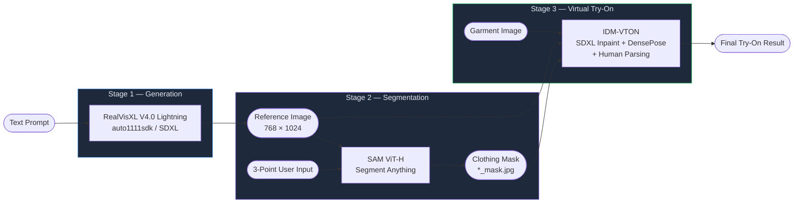
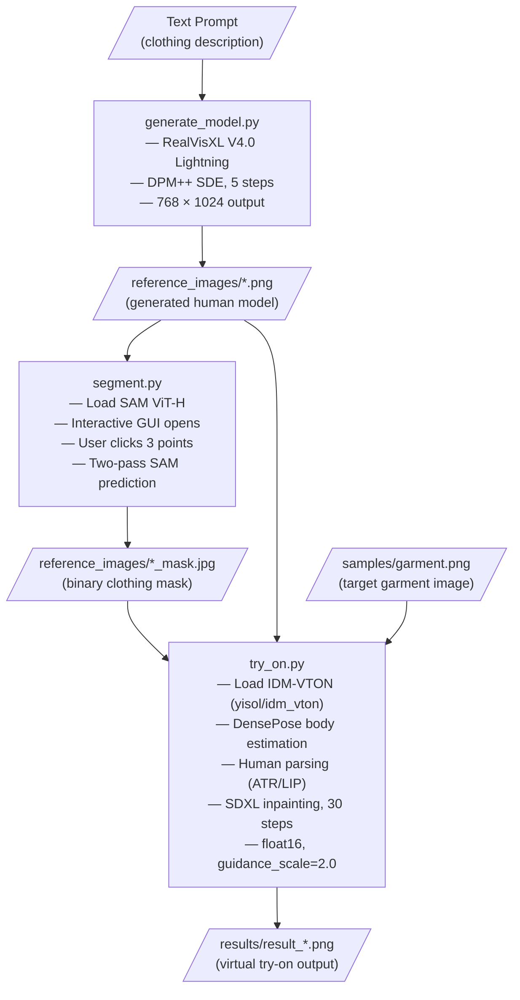

<div align="center">
  
  
# AI Clothing Fashion Design Generator

**Generate realistic AI fashion models and apply garments using image segmentation and virtual try-on.**

Generate photorealistic human fashion models from text prompts, isolate clothing regions with precision segmentation, and transfer new garments onto the generated figure — end-to-end, in three steps.

[](https://python.org)
[](https://pytorch.org)
[](https://github.com/huggingface/diffusers)
[](LICENSE)
[](https://developer.nvidia.com/cuda-toolkit)

</div>

---

## Table of Contents

- [Overview](#overview)
- [Key Features](#key-features)
- [System Architecture](#system-architecture)
- [End-to-End Workflow](#end-to-end-workflow)
- [Tech Stack](#tech-stack)
- [Project Structure](#project-structure)
- [Installation](#installation)
- [Model Setup](#model-setup)
- [Usage](#usage)
- [Input / Output Examples](#input--output-examples)
- [Running on Google Colab](#running-on-google-colab)
- [Hardware Requirements](#hardware-requirements)
- [Limitations](#limitations)
- [Troubleshooting](#troubleshooting)
- [Future Improvements](#future-improvements)
- [Security](#security)
- [Contributing](#contributing)
- [License](#license)
- [Acknowledgements](#acknowledgements)
- [Author](#author)

---

## Overview

The **AI Clothing Fashion Design Generator** is a three-stage generative AI pipeline that takes a text description of a clothing style and produces a fully rendered virtual try-on result.

**Stage 1 — Generation.** [`generate_model.py`](generate_model.py) uses **RealVisXL V4.0 Lightning** (a high-realism SDXL-based model) via the `auto1111sdk` library to generate a photorealistic human figure wearing the described clothing, at 768×1024 resolution with DPM++ SDE sampling in as few as 5 steps.

**Stage 2 — Segmentation.** [`segment.py`](segment.py) loads **Segment Anything Model (SAM ViT-H)** and opens an interactive Matplotlib window. The user clicks three points on the clothing region; SAM uses those coordinates as prompts to produce a precise binary clothing mask, which is saved alongside the reference image.

**Stage 3 — Virtual Try-On.** [`try_on.py`](try_on.py) runs **IDM-VTON** — an SDXL-based inpainting pipeline sourced from `yisol/idm_vton` on Hugging Face — to seamlessly composite a new garment image into the masked region of the generated model, using DensePose body estimation and human parsing as pose conditioning.

This pipeline is useful for fashion designers, AI/ML students, generative AI practitioners, and anyone exploring the intersection of computer vision and fashion technology.

---

## Key Features

| Feature | Description |
|---|---|
| **Text-to-Model Generation** | Generates a photorealistic human figure at 768×1024 from a clothing-style text prompt using RealVisXL V4.0 Lightning via SDXL architecture |
| **Interactive Clothing Segmentation** | Opens a Matplotlib GUI where the user clicks three points on the clothing region; SAM ViT-H produces a precise binary mask |
| **SDXL-Based Virtual Try-On** | IDM-VTON's dual-UNet inpainting pipeline composites a garment image into the masked region at float16 precision |
| **DensePose Conditioning** | Estimates 3D body surface pose from the reference image to guide garment warping and placement |
| **Human Parsing** | Parses the body using ATR/LIP ONNX models to understand clothing regions before applying the garment |
| **Three-Step CLI Pipeline** | Each stage is a standalone Python script with clear `argparse` interfaces, enabling scripted or notebook-based use |
| **Reproducible Outputs** | Fixed or random seed control in both generation and try-on stages |

---

## System Architecture



---

## End-to-End Workflow



**Stage 1 — Generate Human Model**
`generate_model.py` calls `StableDiffusionPipeline` from `auto1111sdk`, loading RealVisXL V4.0 Lightning from a local `.safetensors` weight file. It wraps the user's clothing description in a standardised portrait prompt template, applies a detailed negative prompt to suppress artifacts, and runs text-to-image inference at 768×1024 with `cfg_scale=2`, `steps=5`, and `DPM++ SDE` sampling.

**Stage 2 — Generate Clothing Mask**
`segment.py` loads SAM ViT-H from local weights and moves it to CUDA. It opens the reference image in an interactive Matplotlib window. When the user clicks three positive points on the clothing region, those coordinates are used as `point_coords` for SAM's `SamPredictor`. A two-pass prediction strategy (first with `multimask_output=True` to find the best logit, then a refinement pass with `multimask_output=False`) yields a tight clothing mask, which is saved as a `.jpg` alongside the input image.

**Stage 3 — Virtual Try-On**
`try_on.py` loads the full IDM-VTON pipeline from Hugging Face (`yisol/idm_vton`): a custom dual-UNet SDXL inpainting pipeline with a dedicated garment encoder UNet, CLIP text and vision encoders, and an SDXL VAE. At inference time, it runs DensePose body estimation (via Detectron2 and a local `.pkl` checkpoint) to extract a pose image, then runs the inpainting pipeline for 30 denoising steps at `guidance_scale=2.0` in float16, compositing the garment into the masked region.

---

## Tech Stack

### Generative AI

| Model / Library | Role |
|---|---|
| [RealVisXL V4.0 Lightning](https://civitai.com/models/139562) | Text-to-image generation of realistic human fashion models |
| [IDM-VTON](https://github.com/yisol/IDM-VTON) (`yisol/idm_vton`) | SDXL-based virtual garment try-on via dual-UNet inpainting |
| [Segment Anything (SAM)](https://github.com/facebookresearch/segment-anything) | Point-prompted clothing region segmentation |
| [auto1111sdk](https://github.com/Auto1111sdk/auto1111sdk) | Python SDK wrapper for Stable Diffusion inference |

### Computer Vision & Deep Learning

| Library | Version | Role |
|---|---|---|
| [PyTorch](https://pytorch.org) | 2.1.0 | Core deep learning framework |
| [Diffusers](https://github.com/huggingface/diffusers) | 0.25.0 | SDXL pipeline, DDPMScheduler, AutoencoderKL |
| [Transformers](https://github.com/huggingface/transformers) | 4.30.2 | CLIP encoders, tokenizers |
| [Detectron2](https://github.com/facebookresearch/detectron2) | (from source) | DensePose body estimation |
| [OpenCV](https://opencv.org) | — | Image I/O and colour conversion |
| [torchvision](https://pytorch.org/vision) | — | Image transforms and tensor utilities |
| [onnxruntime](https://onnxruntime.ai) | 1.16.2 | Human parsing inference (ATR/LIP ONNX models) |
| [bitsandbytes](https://github.com/TimDettmers/bitsandbytes) | 0.39.0 | Memory-efficient quantisation utilities |

### Python Ecosystem

| Library | Role |
|---|---|
| NumPy 1.23.5 | Array operations, mask processing |
| Pillow 9.5.0 | Image loading and saving |
| Matplotlib | Interactive segmentation GUI |
| accelerate 0.21.0 | Hugging Face model acceleration |
| safetensors 0.3.1 | Loading `.safetensors` model weights |
| einops 0.4.1 | Tensor rearrangement |
| kornia 0.6.7 | Differentiable computer vision utilities |

---

## Project Structure

```text
Piyu-AI-Clothing-Fashion-Design-Generator/
│
├── generate_model.py          # Stage 1: Text-to-image with RealVisXL via auto1111sdk
├── segment.py                 # Stage 2: Interactive clothing segmentation with SAM ViT-H
├── try_on.py                  # Stage 3: Virtual try-on with IDM-VTON
│
├── requirements.txt           # Python dependencies
├── LICENSE                    # MIT License
├── .gitignore                 # Excludes .pth, .pkl, .safetensors, .onnx weights
│
├── reference_images/          # Generated human model images and their masks
│   ├── crop_top.png
│   ├── crop_top_mask.jpg
│   ├── dress.png
│   ├── dress_mask.jpg
│   ├── jumpsuit.png
│   └── jumpsuit_mask.jpg
│
├── samples/                   # Input garment images for try-on
│   ├── garment.png
│   └── sample_image.jpg
│
└── results/                   # Final virtual try-on outputs
    ├── result_crop_top.png
    ├── result_dress.png
    └── result_jumpsuit.png
```

> **Note:** Model weight files (`.safetensors`, `.pth`, `.pkl`, `.onnx`) are excluded from the repository via `.gitignore` and must be downloaded separately. See [Model Setup](#model-setup).

---

## Installation

### Prerequisites

| Requirement | Details |
|---|---|
| Python | 3.8 or higher |
| NVIDIA GPU | Required — CPU inference is not practical for these models |
| VRAM | 16 GB recommended minimum; 24 GB for comfortable operation |
| CUDA | 11.8 or 12.1 compatible with PyTorch 2.1.0 |
| Disk Space | ~20–25 GB for all model weights (SAM ViT-H ~2.5 GB, RealVisXL ~6 GB, IDM-VTON ~8–10 GB, DensePose/parsing checkpoints) |
| Git | For cloning this repository and IDM-VTON |

> VRAM estimate is based on the models loaded: RealVisXL SDXL, IDM-VTON dual-UNet SDXL at float16, and SAM ViT-H.

### 1. Clone the Repository

```bash
git clone https://github.com/Piyu242005/Piyu-AI-clothing-fashion-design-generator.git
cd Piyu-AI-clothing-fashion-design-generator
```

### 2. Create a Virtual Environment

**Linux / macOS**
```bash
python3 -m venv venv
source venv/bin/activate
```

**Windows**
```powershell
python -m venv venv
.\venv\Scripts\activate
```

### 3. Install Python Dependencies

```bash
pip install --upgrade pip
pip install -r requirements.txt
```

> If you encounter issues with `torch==2.1.0`, install a CUDA-specific wheel first:
> ```bash
> pip install torch==2.1.0 torchvision --index-url https://download.pytorch.org/whl/cu118
> ```

### 4. Clone IDM-VTON and Place try_on.py

`try_on.py` depends on IDM-VTON's internal modules (`src/`, `utils_mask.py`, `apply_net.py`, `preprocess/`).

```bash
git clone https://github.com/yisol/IDM-VTON.git idm_vton
cp try_on.py idm_vton/
```

### 5. Install Detectron2

Detectron2 is required for DensePose body estimation used in the try-on stage.

```bash
pip install 'git+https://github.com/facebookresearch/detectron2.git'
```

### 6. Install Segment Anything

```bash
pip install 'git+https://github.com/facebookresearch/segment-anything.git'
```

---

## Model Setup

All model weights must be downloaded manually. They are intentionally excluded from the repository via `.gitignore`.

### Weight Files Summary

| Model | Purpose | Location | Size (approx.) |
|---|---|---|---|
| `realvisxlV40_v40LightningBakedvae.safetensors` | Human fashion model generation | `weights/` | ~6 GB |
| `sam_vit_h_4b8939.pth` | Clothing segmentation | `weights/` | ~2.5 GB |
| IDM-VTON HF model (`yisol/idm_vton`) | Virtual try-on pipeline | Hugging Face cache | ~8–10 GB |
| `model_final_162be9.pkl` | DensePose body estimation | `idm_vton/ckpt/densepose/` | ~245 MB |
| `parsing_atr.onnx` | Human parsing (ATR) | `idm_vton/ckpt/humanparsing/` | ~80 MB |
| `parsing_lip.onnx` | Human parsing (LIP) | `idm_vton/ckpt/humanparsing/` | ~80 MB |
| `body_pose_model.pth` | OpenPose body keypoints | `idm_vton/ckpt/openpose/ckpts/` | ~200 MB |

### Download Commands

```bash
# RealVisXL V4.0 Lightning (from CivitAI)
wget "https://civitai.com/api/download/models/361593?type=Model&format=SafeTensor&size=pruned&fp=fp16" \
     --directory-prefix weights --content-disposition

# SAM ViT-H weights (Meta AI)
wget https://dl.fbaipublicfiles.com/segment_anything/sam_vit_h_4b8939.pth \
     --directory-prefix weights

# DensePose checkpoint
wget "https://huggingface.co/spaces/yisol/IDM-VTON/resolve/main/ckpt/densepose/model_final_162be9.pkl?download=true" \
     --directory-prefix idm_vton/ckpt/densepose --content-disposition

# Human parsing models
wget "https://huggingface.co/spaces/yisol/IDM-VTON/resolve/main/ckpt/humanparsing/parsing_atr.onnx?download=true" \
     --directory-prefix idm_vton/ckpt/humanparsing --content-disposition

wget "https://huggingface.co/spaces/yisol/IDM-VTON/resolve/main/ckpt/humanparsing/parsing_lip.onnx?download=true" \
     --directory-prefix idm_vton/ckpt/humanparsing --content-disposition

# OpenPose body estimation
wget "https://huggingface.co/spaces/yisol/IDM-VTON/resolve/main/ckpt/openpose/ckpts/body_pose_model.pth?download=true" \
     --directory-prefix idm_vton/ckpt/openpose/ckpts --content-disposition
```

> The IDM-VTON pipeline weights (`yisol/idm_vton`) are downloaded automatically from Hugging Face on the first run of `try_on.py`. Ensure you have a Hugging Face account and have accepted any model terms if access-gated. See [Security](#security) for token handling.

---

## Usage

### Step 1 — Generate the Human Fashion Model

```bash
python generate_model.py \
  --prompt "a crop top and mini skirt" \
  --output_path "reference_images/crop_top.png"
```

This generates a 768×1024 photorealistic portrait of a woman wearing the described clothing using RealVisXL V4.0 Lightning with a standardised negative prompt to suppress common artifacts. The result is saved to `reference_images/`.

Additional examples from the repository:
```bash
python generate_model.py --prompt "a maxi dress with cut out details" --output_path "reference_images/dress.png"
python generate_model.py --prompt "A formal jumpsuit with a belt" --output_path "reference_images/jumpsuit.png"
```

---

### Step 2 — Generate the Clothing Mask

```bash
python segment.py --input "reference_images/crop_top.png"
```

Running this command:
1. Loads SAM ViT-H onto the GPU.
2. Opens a Matplotlib window displaying the reference image.
3. **You must click exactly three points** on the clothing region you wish to replace. Clicks are recorded as positive SAM point prompts.
4. After the third click, the window closes and SAM runs a two-pass prediction (multi-mask pass to select the best logit, followed by a refined single-mask pass).
5. The binary clothing mask is automatically saved as `reference_images/crop_top_mask.jpg`.

> **Important:** This step requires a desktop display environment. It will not work directly in a headless server or standard Google Colab session without a virtual display. See [Running on Google Colab](#running-on-google-colab).

---

### Step 3 — Apply the New Garment (Virtual Try-On)

> Run this from inside the `idm_vton/` directory (where `try_on.py` was copied):

```bash
cd idm_vton

python try_on.py \
  --reference_image "../reference_images/crop_top.png" \
  --mask "../reference_images/crop_top_mask.jpg" \
  --garment "../samples/garment.png" \
  --cloth_type "crop top" \
  --output_path "../results/result_crop_top.png"
```

| Argument | Description |
|---|---|
| `--reference_image` | The generated human model image from Step 1 |
| `--mask` | The binary clothing mask from Step 2 |
| `--garment` | The target garment image to apply |
| `--cloth_type` | Text description of the garment (used in the inpainting prompt) |
| `--output_path` | Where to save the final try-on result |

The pipeline runs 30 DDPM denoising steps at float16 with `guidance_scale=2.0`. DensePose body estimation conditions the garment placement on the body geometry. The result image is 768×1024.

---

## Input / Output Examples

The repository includes three worked examples with all inputs and outputs committed:

```
Reference images (generated in Step 1):
  reference_images/crop_top.png
  reference_images/dress.png
  reference_images/jumpsuit.png

Clothing masks (generated in Step 2):
  reference_images/crop_top_mask.jpg
  reference_images/dress_mask.jpg
  reference_images/jumpsuit_mask.jpg

Sample garment:
  samples/garment.png

Virtual try-on results (generated in Step 3):
  results/result_crop_top.png
  results/result_dress.png
  results/result_jumpsuit.png
```

**Data flow summary:**

```
TEXT PROMPT
    │
    ▼  generate_model.py (RealVisXL)
AI MODEL IMAGE (768×1024)
    │
    ├──────────────────────────┐
    ▼  segment.py (SAM ViT-H)  │
CLOTHING MASK (*_mask.jpg)     │
    │                          │
    ▼  try_on.py (IDM-VTON)  ◄─┘
        + GARMENT IMAGE
    │
    ▼
VIRTUAL TRY-ON RESULT (768×1024)
```

---

## Running on Google Colab

For users without a local NVIDIA GPU, Google Colab provides free and paid GPU runtimes that can run this pipeline.

### Setup

**1. Enable GPU runtime**

In Colab: `Runtime → Change runtime type → Hardware accelerator → T4 GPU` (or A100 for Pro).

**2. Verify CUDA availability**

```python
!nvidia-smi
```

Confirm that a GPU is listed and CUDA version is shown.

**3. Install dependencies**

```python
!pip install -r requirements.txt
!pip install 'git+https://github.com/facebookresearch/detectron2.git'
!pip install 'git+https://github.com/facebookresearch/segment-anything.git'
```

**4. Clone IDM-VTON**

```python
!git clone https://github.com/yisol/IDM-VTON.git idm_vton
```

**5. Download model weights**

Use the `wget` commands from [Model Setup](#model-setup) directly in Colab cells.

**6. Run the generation and try-on stages**

`generate_model.py` and `try_on.py` run without a display and work in Colab without modification.

### Segmentation in Colab

`segment.py` opens an interactive Matplotlib GUI using `plt.show()`, which requires a desktop display. **This will not render in a standard Colab notebook.**

**Workaround:** Provide the three click coordinates manually and replace the `onclick` / `plt.show()` block with hardcoded `garment_locations`:

```python
# Replace the interactive GUI section in segment.py for Colab use
garment_locations = [[x1, y1], [x2, y2], [x3, y3]]  # Set your coordinates
```

> **Colab storage note:** The free Colab tier provides approximately 100 GB of temporary disk space per session. Model weights (~20–25 GB total) will be lost when the session ends and must be re-downloaded each time unless stored on Google Drive.

---

## Hardware Requirements

| Component | Recommendation |
|---|---|
| GPU | NVIDIA GPU with CUDA support |
| VRAM | 16 GB minimum; 24 GB recommended |
| RAM | 16 GB minimum system RAM |
| Disk | 25–30 GB free space for weights + environment |
| CUDA | 11.8 or 12.1 |
| Python | 3.8 or higher |
| OS | Linux, macOS, or Windows (Linux recommended) |

> Requirements are inferred from the models in use: RealVisXL SDXL, IDM-VTON dual-UNet SDXL pipeline, and SAM ViT-H, all running at float16 precision. Actual VRAM usage will vary with image resolution and batch size.

---

## Limitations

- **Large model downloads.** Total weight files exceed 20 GB. Initial setup requires significant time and bandwidth.
- **GPU required.** The models are loaded on CUDA (`cuda:0` / `cuda`). CPU inference is not supported in the current implementation.
- **VRAM pressure.** Loading RealVisXL and IDM-VTON with all submodels simultaneously is demanding. Running each stage sequentially (separate script calls) is the recommended approach.
- **Manual segmentation.** Step 2 requires a user to click three points interactively on a desktop display. It cannot run headlessly without code modification.
- **Segmentation accuracy.** Mask quality depends on the accuracy of the three user-selected click points. Poorly placed points may produce incorrect masks.
- **Try-on quality depends on input quality.** IDM-VTON produces best results when the reference image and garment image are clean, well-lit, and at 768×1024 resolution. Unusual poses, complex backgrounds, or low-quality garment images degrade output quality.
- **Colab session limits.** Weights are stored in temporary Colab storage and are lost when the session disconnects.
- **Fixed resolution.** The pipeline operates at 768×1024. Higher resolutions are not supported without modifying the scripts.
- **Single garment at a time.** The pipeline applies one garment per run. Multi-garment workflows require multiple sequential runs.

---

## Troubleshooting

### CUDA not detected

```bash
nvidia-smi
python -c "import torch; print(torch.cuda.is_available())"
```

If `False` is returned, verify that the installed PyTorch build matches your CUDA version:

```bash
python -c "import torch; print(torch.version.cuda)"
```

Reinstall with the correct CUDA wheel:
```bash
pip install torch==2.1.0 torchvision --index-url https://download.pytorch.org/whl/cu118
```

---

### Out of GPU memory

- Run each stage as a separate script invocation rather than importing all models in the same process.
- Restart the Python process between stages to free VRAM.
- Ensure no other GPU-intensive processes are running.
- If using Colab, select an A100 runtime (Colab Pro) for more VRAM.

---

### Model weight file not found

`generate_model.py` expects the RealVisXL weight at:
```
weights/realvisxlV40_v40LightningBakedvae.safetensors
```

`segment.py` expects SAM ViT-H at:
```
weights/sam_vit_h_4b8939.pth
```

`try_on.py` expects DensePose at:
```
idm_vton/ckpt/densepose/model_final_162be9.pkl
```

Verify the paths exist before running:
```bash
ls weights/
ls idm_vton/ckpt/densepose/
```

---

### IDM-VTON module import errors (`src.tryon_pipeline`, `utils_mask`, `apply_net`)

These modules exist inside the IDM-VTON repository. Make sure `try_on.py` is placed inside the `idm_vton/` directory and run from there:

```bash
cd idm_vton
python try_on.py ...
```

---

### Segmentation window does not open

`segment.py` requires a desktop display (`plt.show()` is blocking). On headless servers or Google Colab, the window will not render.

- **Local machine:** Ensure a display server is running (Linux: confirm `$DISPLAY` is set; use X11 forwarding for remote sessions).
- **Google Colab:** See [Running on Google Colab](#running-on-google-colab) for the manual coordinates workaround.

---

### Hugging Face access errors for IDM-VTON

If `yisol/idm_vton` requires authentication:

```bash
pip install huggingface_hub
huggingface-cli login
```

Or set the token as an environment variable (see [Security](#security)).

---

## Future Improvements

The following are planned improvements and have **not yet been implemented**.

### Phase 1 — Core Robustness
- Automatic clothing region segmentation without manual point selection
- Improved error messages and input validation across all three scripts
- Centralised model path configuration file

### Phase 2 — Interface
- Gradio or Streamlit web interface to replace the CLI workflow
- In-browser interactive segmentation to replace the desktop Matplotlib GUI
- Support for multiple garment categories (upper body, lower body, full-body)

### Phase 3 — Capability Expansion
- Text-guided garment generation (design a garment from a description, then apply it)
- Support for custom garment images uploaded by the user
- Style and colour transfer controls
- Batch processing for multiple garments or models

### Phase 4 — Product Features
- Virtual wardrobe: save and organise try-on results by garment and outfit
- Affordable product recommendations based on generated designs
- User history and project management
- Export pipeline for social media formats

---

## Security

- **Never commit model weights** or Hugging Face tokens to the repository. The `.gitignore` already excludes `.pth`, `.pkl`, `.onnx`, and `.safetensors` files.
- Store your Hugging Face token as an environment variable:

  ```bash
  export HF_TOKEN="your_token_here"
  ```

  Or on Windows:
  ```powershell
  $env:HF_TOKEN = "your_token_here"
  ```

- Do not hardcode tokens, API keys, or credentials in any script.
- Add any local secrets files to `.gitignore` before committing.

---

## Contributing

Contributions are welcome. Please follow this workflow:

1. **Fork** the repository on GitHub.
2. **Create a feature branch** from `main`:
   ```bash
   git checkout -b feature/your-feature-name
   ```
3. **Make your changes.** Keep commits focused on a single change.
4. **Test your changes** with all three pipeline stages before submitting.
5. **Commit** with a clear message:
   ```bash
   git commit -m "feat: add automatic clothing segmentation"
   ```
6. **Push** to your fork:
   ```bash
   git push origin feature/your-feature-name
   ```
7. **Open a Pull Request** against the `main` branch with a description of what was changed and why.

---

## License

This project is licensed under the **MIT License** — see the [LICENSE](LICENSE) file for the full text.

The underlying models used in this pipeline have their own licenses:

- **RealVisXL V4.0 Lightning** — subject to [CivitAI model terms](https://civitai.com/models/139562) and the Stability AI SDXL Community License.
- **Segment Anything (SAM)** — Apache 2.0 License. Copyright © Meta Platforms, Inc.
- **IDM-VTON** — subject to the [IDM-VTON license](https://github.com/yisol/IDM-VTON/blob/main/LICENSE). Review before commercial use.

---

## Acknowledgements

This project is built on top of the following open-source models and libraries:

- **[IDM-VTON](https://github.com/yisol/IDM-VTON)** by yisol — the core virtual try-on pipeline.
- **[Segment Anything (SAM)](https://github.com/facebookresearch/segment-anything)** by Meta AI Research — interactive and zero-shot image segmentation.
- **[RealVisXL V4.0 Lightning](https://civitai.com/models/139562)** — high-realism SDXL human generation model.
- **[Diffusers](https://github.com/huggingface/diffusers)** by Hugging Face — SDXL pipeline infrastructure.
- **[Detectron2](https://github.com/facebookresearch/detectron2)** by Meta AI Research — DensePose body estimation.
- **[auto1111sdk](https://github.com/Auto1111sdk/auto1111sdk)** — Python SDK for Stable Diffusion inference.

---

## Author

**Piyush Ramteke**

GitHub: [github.com/Piyu242005](https://github.com/Piyu242005)

---

<div align="center">
  <sub>AI Clothing Fashion Design Generator &nbsp;·&nbsp; MIT License</sub>
</div>


---

<div align="center">
  <b>Built with ❤️ for the future of digital fashion.</b><br><br>
  <a href="#-ai-fashion-design-generator">⬆ Back to Top</a>
</div>
