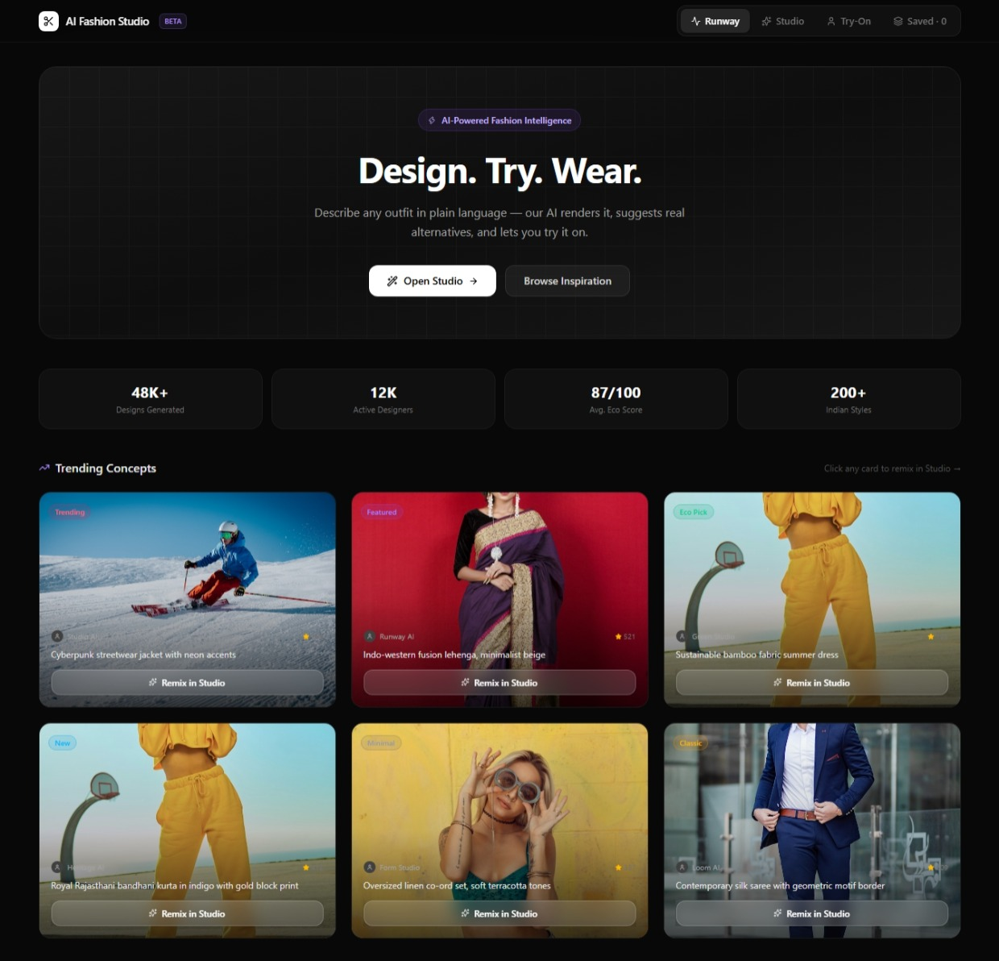
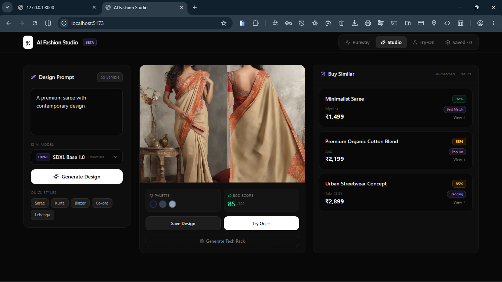

<div align="center">

# ✂️ AI Fashion Design Generator

**Describe any outfit. AI renders it. Try it on.**

[](https://react.dev)
[](https://fastapi.tiangolo.com)
[](https://developers.cloudflare.com/workers-ai/)
[](https://python.org)
[](https://ibm.com)

**Built by [Piyush Ramteke](https://github.com/piyushramteke) · IBM Internship 2026**

</div>

---

## Problem Statement

Many students want to explore fashion design but lack artistic or technical skills. Traditional design tools are expensive, have steep learning curves, and are time-consuming. This project provides a **generative AI solution** that:

- Creates clothing designs from plain-language text prompts
- Suggests similar, affordable products available online
- Lets you virtually try on any generated garment
- Makes fashion design **accessible, fast, and fun** — no design skills required

---

## Overview

**AI Fashion Design Generator** is a full-stack AI web app that lets you describe any outfit in plain English and instantly:
1. Generate a photorealistic fashion render via Cloudflare Workers AI (FLUX.1-schnell, SDXL, DreamShaper)
2. See matching affordable alternatives from Myntra, Ajio, and Tata CLiQ
3. Virtually try the garment on by uploading your own photo
4. Save designs to your local collection and generate manufacturing tech packs

```
You type a prompt
      ↓
Gemini extracts the fashion spec   (free tier, client-side)
      ↓
FastAPI → Cloudflare Workers AI    (token stays server-side)
      ↓
FLUX.1 / SDXL / DreamShaper renders the image
      ↓
React displays result + shopping alternatives
```

---

---

## Screenshots

### Dashboard — Runway & Trending Concepts


### Studio — Generated Design Output


---

## Features

| Feature | Description |
|---|---|
| 🎨 **AI Design Studio** | Text-to-fashion image generation with 4 selectable models |
| 🧠 **Model Selector** | Switch between FLUX.1 Schnell, SDXL, DreamShaper, SDXL Lightning |
| 🛍️ **Smart Shopping** | AI-matched affordable alternatives on Myntra, Ajio, Tata CLiQ |
| 👗 **Virtual Try-On** | Composite your photo with the generated garment |
| 💾 **Collections** | Save designs locally, set price-drop alerts |
| 📋 **Tech Pack** | Export manufacturing spec sheet (fabric, colors, cost estimate) |
| 🔒 **Secure by design** | API tokens never reach the browser |
| 🌱 **Eco Score** | Sustainability scoring per design |

---

## Tech Stack

### Frontend
- **React 19** + **Vite 8**
- **Tailwind CSS v4** — utility-first styling
- **lucide-react** — icons

### Backend
- **FastAPI** — async Python API
- **httpx** — async HTTP client for Cloudflare
- **Pydantic v2** — request/response validation
- **python-dotenv** — environment variable loading

### AI Providers
| Role | Provider | Free? |
|---|---|---|
| Image generation | Cloudflare Workers AI | ✅ 10,000 neurons/day free |
| Fashion spec extraction (optional) | Google Gemini 2.5 Flash | ✅ Free tier |

---

## Supported Image Models

Select any model from the **AI Model** dropdown in the Studio tab:

| Model | Badge | Best For |
|---|---|---|
| `@cf/black-forest-labs/flux-1-schnell` | ⚡ Fast | Best quality/speed for fashion renders |
| `@cf/stabilityai/stable-diffusion-xl-base-1.0` | 🔍 Detailed | Higher detail, slightly slower |
| `@cf/lykon/dreamshaper-8-lcm` | 🎨 Artistic | Painterly, creative illustrations |
| `@cf/bytedance/stable-diffusion-xl-lightning` | 🚀 Fastest | Ultra-fast 4-step generation |

---

## Project Structure

```
IBM-INTERSHIP-2026/
├── src/
│   ├── App.jsx          # Main React component (all UI, ~1200 lines)
│   ├── main.jsx         # React root mount
│   └── index.css        # Tailwind v4 entry
│
├── backend/
│   ├── app/
│   │   ├── main.py              # FastAPI app + CORS + rate limiting
│   │   ├── api/
│   │   │   └── design.py        # POST /api/design router
│   │   ├── services/
│   │   │   └── cloudflare_ai.py # Cloudflare Workers AI integration
│   │   └── schemas/
│   │       └── design.py        # Pydantic models + model allowlist
│   ├── tests/
│   │   └── test_design.py       # Unit tests (fully mocked)
│   └── requirements.txt
│
├── api/                 # Vercel serverless functions (alternative deploy)
│   ├── design.py        # POST /api/design
│   └── health.py        # GET /api/health
│
├── samples/             # Sample wardrobe images (16 outfits, imported by src/App.jsx)
│
├── public/
│   └── screenshots/     # README screenshots
│
├── index.html           # Vite entry point
├── vite.config.js       # Vite + Tailwind v4 + React plugin
├── vercel.json          # Vercel deployment config
├── .env.example         # Template — copy to .env
├── .gitignore
├── README.md
└── README-API-SETUP.md  # Detailed API / environment setup guide
```

---

## Quick Start

### Prerequisites
- Node.js 18+
- Python 3.10+
- A free [Cloudflare account](https://dash.cloudflare.com)

### 1. Clone & install frontend

```bash
git clone <your-repo-url>
cd IBM-INTERSHIP-2026
npm install
```

### 2. Configure environment

```bash
cp .env.example .env
```

Open `.env` and set:

```env
# Required for image generation
CLOUDFLARE_ACCOUNT_ID=your_account_id
CLOUDFLARE_API_TOKEN=your_api_token

# Optional — for Gemini fashion spec extraction
VITE_GEMINI_API_KEY=your_gemini_key
```

> ⚠️ Never commit `.env`. It is already in `.gitignore`.

### 3. Start the FastAPI backend

```bash
cd backend
python -m venv venv

# Windows
venv\Scripts\activate

# macOS / Linux
source venv/bin/activate

pip install -r requirements.txt
uvicorn app.main:app --reload --port 8000
```

Check it's running:
```
GET http://localhost:8000/api/health
```

### 4. Start the React frontend

```bash
# In a new terminal from project root
npm run dev
```

Open **http://localhost:5173**

---

## Cloudflare Workers AI Setup

### Get your Account ID
Your Account ID is in the **right sidebar** of [dash.cloudflare.com](https://dash.cloudflare.com).

### Create an API Token
1. Go to **My Profile → API Tokens → Create Token**
2. Select **"Create Custom Token"**
3. Set permissions:
   - **Workers AI** → Read
   - **Workers AI** → Edit
4. Click **Continue to summary → Create Token**
5. Copy the token immediately — it's shown only once

---

## API Reference

### `POST /api/design`

Generate a fashion image via Cloudflare Workers AI.

**Request**
```json
{
  "prompt": "Modern Indian half-saree in pastel pink and gold",
  "model": "@cf/black-forest-labs/flux-1-schnell"
}
```

The `model` field is optional — defaults to `@cf/black-forest-labs/flux-1-schnell`.

**Success Response**
```json
{
  "success": true,
  "image": "data:image/png;base64,...",
  "provider": "cloudflare"
}
```

**Error Response**
```json
{
  "success": false,
  "error": {
    "code": "IMAGE_GENERATION_FAILED",
    "message": "Unable to generate the fashion design. Please try again."
  }
}
```

### `GET /api/health`

```json
{
  "status": "ok",
  "provider": "cloudflare",
  "configured": true
}
```

### `GET /api/models`

```json
{
  "default": "@cf/black-forest-labs/flux-1-schnell",
  "models": [
    { "id": "@cf/black-forest-labs/flux-1-schnell",         "label": "flux-1-schnell" },
    { "id": "@cf/bytedance/stable-diffusion-xl-lightning",  "label": "stable-diffusion-xl-lightning" },
    { "id": "@cf/lykon/dreamshaper-8-lcm",                  "label": "dreamshaper-8-lcm" },
    { "id": "@cf/stabilityai/stable-diffusion-xl-base-1.0", "label": "stable-diffusion-xl-base-1.0" }
  ]
}
```

---

## Running Tests

```bash
cd backend
pytest tests/ -v
```

7 tests covering:
1. Backend starts correctly
2. `/api/health` returns expected structure
3. Input validation (prompt too short)
4. Missing credentials → safe 503 (no token leaked)
5. Cloudflare errors are sanitised (no raw errors exposed)
6. Successful generation returns `data:image/png;base64,...`
7. Credentials never appear in any response

All tests are **fully mocked** — no real Cloudflare API calls or credits used.

---

## Security

- `CLOUDFLARE_API_TOKEN` and `CLOUDFLARE_ACCOUNT_ID` live only in the server-side `.env`
- Tokens are never logged, printed, or included in error responses
- Raw Cloudflare error bodies are sanitised before reaching the client
- CORS is an explicit allow-list (no wildcard `*` in production)
- `.env` is listed in `.gitignore` and excluded from all commits

---

## Example Prompts

```
Modern Indian half-saree in pastel pink and gold

Royal Rajasthani bandhani kurta, indigo with gold block print

Oversized linen co-ord set in soft terracotta

Contemporary silk saree with geometric motif border

Minimalist black cotton kurta with white embroidery under ₹3000

Cyberpunk streetwear jacket with neon accents
```

---

## License

MIT — free for personal, educational, and commercial use.

---

---

## Creator

<div align="center">

**Piyush Ramteke**
IBM Internship 2026

*"Making fashion design accessible to everyone through the power of generative AI."*

</div>

---

<div align="center">
  Built with ❤️ by <strong>Piyush Ramteke</strong> · IBM Internship 2026<br/>
  Powered by Cloudflare Workers AI · FastAPI · React
</div>
