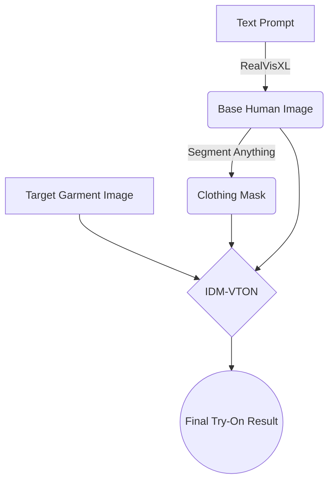

<div align="center">
  

  # 👗 AI Fashion Design Generator
  
  **Next-Generation Virtual Fashion Prototyping & Try-On Pipeline**
  
  [](https://python.org)
  [](LICENSE)
  []()
  
  <p align="center">
    <a href="#-about-the-project">About</a> •
    <a href="#-core-technologies">Technologies</a> •
    <a href="#-pipeline-architecture">Architecture</a> •
    <a href="#-getting-started">Getting Started</a> •
    <a href="#-usage-workflow">Usage</a>
  </p>
</div>

---

## ✨ About The Project

The fashion industry has always been at the forefront of innovation. In recent years, advancements in artificial intelligence have revolutionized design, allowing for unprecedented creativity and efficiency. 

**The AI Fashion Design Generator** is a sophisticated, end-to-end pipeline that empowers designers to create and visualize new clothing designs with remarkable precision and realism. By seamlessly integrating three state-of-the-art AI models, this tool bridges the gap between imagination and photorealistic rendering.

> *"Designing the future of fashion, one pixel at a time."*

---

## 🚀 Core Technologies

Our pipeline leverages the cutting edge of generative AI and computer vision:

<details open>
<summary><b>1️⃣ RealVisXL V4.0 (Human Generation)</b></summary>
<br>
An advanced AI system built on SDXL architecture, designed for generating highly realistic human figures and avatars.

- **High Realism**: Generates detailed textures, accurate lighting, and photorealistic shadows.
- **Customization**: Extensive control over clothing style, body shape, and pose via textual prompts.
- **Use Case**: Creates the foundational virtual model tailored to your exact specifications.
</details>

<details open>
<summary><b>2️⃣ Segment Anything Model / SAM (Masking)</b></summary>
<br>
Facebook's (Meta) breakthrough foundation model for image segmentation, utilizing powerful Vision Transformers (ViT).

- **Zero-Shot Precision**: Incredibly accurate segmentation without domain-specific training.
- **Interactive**: Point-and-click masking to isolate exact clothing regions.
- **Use Case**: Delineates specific areas of the clothing on the virtual figure for precise garment replacement.
</details>

<details open>
<summary><b>3️⃣ IDM-VTON (Virtual Try-On)</b></summary>
<br>
Image-based Deep Matching Virtual Try-On Network. The state-of-the-art in realistic garment transfer.

- **Geometric Matching**: Warps clothing naturally to the contours and pose of the human figure.
- **High-Fidelity Synthesis**: Combines the warped clothing with the human segment using advanced cGANs.
- **Use Case**: Seamlessly integrates the target garment into the masked area, resulting in a flawless final image.
</details>

---

## 🏗 Pipeline Architecture



---

## 💻 Getting Started

Follow these steps to set up the ultimate fashion generation environment on your local machine.

### 🛠 Prerequisites
- Python 3.8+
- Git
- CUDA-compatible GPU (highly recommended for faster inference)

### 📦 1. Installation & Setup

```bash
# Clone this repository (if you haven't already)
git clone https://github.com/Piyu242005/Piyu-AI-clothing-fashion-design-generator.git
cd Piyu-AI-clothing-fashion-design-generator-main

# Install Python dependencies
pip install -r requirements.txt

# Clone the IDM-VTON submodule/repository
git clone https://github.com/yisol/IDM-VTON.git

# Move the try-on execution script into the IDM-VTON directory
mv try_on.py idm_vton/
```

### 📥 2. Download Model Weights

Our pipeline requires specific weights for each model component. Run the following commands to download them into their respective directories:

```bash
# 1. Base Model for generation (RealVisXL)
wget https://civitai.com/api/download/models/361593?type=Model&format=SafeTensor&size=pruned&fp=fp16 --directory-prefix weights --content-disposition

# 2. Segment Anything (SAM) weights
wget https://dl.fbaipublicfiles.com/segment_anything/sam_vit_h_4b8939.pth --directory-prefix weights

# 3. IDM-VTON necessary checkpoints
wget https://huggingface.co/spaces/yisol/IDM-VTON/resolve/main/ckpt/densepose/model_final_162be9.pkl?download=true --directory-prefix idm_vton/ckpt/densepose --content-disposition
wget https://huggingface.co/spaces/yisol/IDM-VTON/resolve/main/ckpt/humanparsing/parsing_atr.onnx?download=true --directory-prefix idm_vton/ckpt/humanparsing --content-disposition
wget https://huggingface.co/spaces/yisol/IDM-VTON/resolve/main/ckpt/humanparsing/parsing_lip.onnx?download=true --directory-prefix idm_vton/ckpt/humanparsing --content-disposition
wget https://huggingface.co/spaces/yisol/IDM-VTON/resolve/main/ckpt/openpose/ckpts/body_pose_model.pth?download=true --directory-prefix idm_vton/ckpt/openpose/ckpts --content-disposition
```

---

## 🎨 Usage Workflow

The process is divided into three intuitive steps:

### Step 1: Generate the Base Model
Create your realistic human avatar based on a text prompt.
```bash
python generate_model.py --prompt "a crop top and mini skirt" --output_path "reference_images/crop_top.png"
```

### Step 2: Create the Segmentation Mask
A window will open allowing you to interactively click **three points** on the clothing item you wish to replace.
```bash
python segment.py --input "reference_images/crop_top.png"
```
*(This will automatically save the mask as `reference_images/crop_top_mask.jpg`)*

### Step 3: Apply the New Garment (Virtual Try-On)
Merge your new garment onto the generated model using the mask you just created.
```bash
python idm_vton/try_on.py \
  --reference_image "reference_images/crop_top.png" \
  --mask "reference_images/crop_top_mask.jpg" \
  --garment "samples/garment.png" \
  --cloth_type "crop top" \
  --output_path "results/result.png"
```

---

<div align="center">
  <b>Built with ❤️ for the future of digital fashion.</b><br><br>
  <a href="#-ai-fashion-design-generator">⬆ Back to Top</a>
</div>
