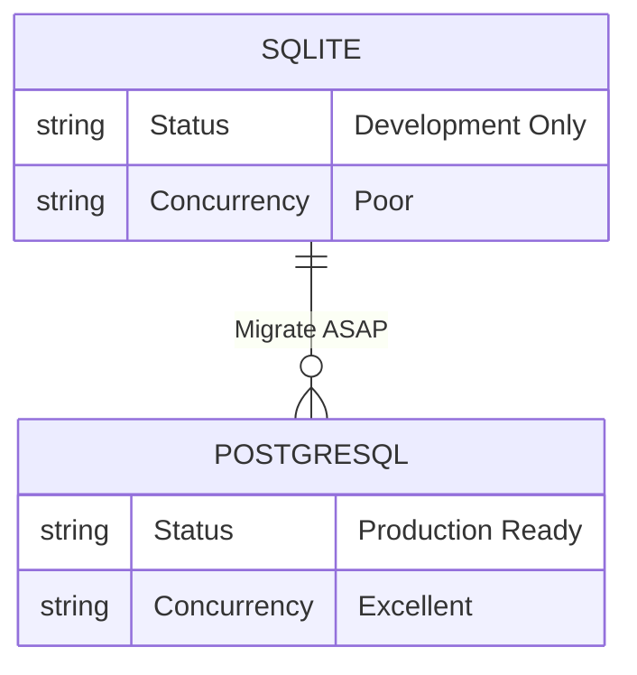
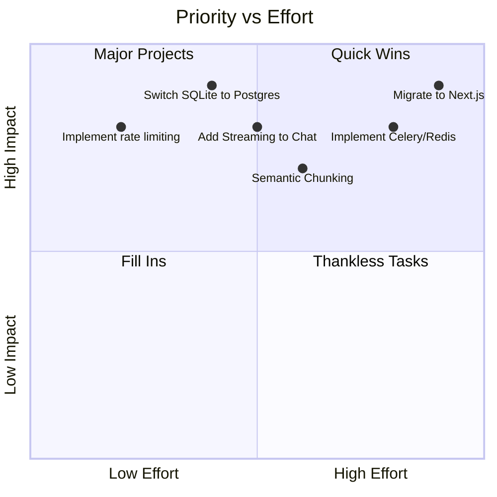

# 🏛️ Senior Technical Review: AI-Powered Study Buddy

**Reviewer Profile:** Senior Staff Engineer, AI Solutions Architect, Principal Product Designer
**Date:** August 2026
**Target:** `AI-Powered Study Buddy`

This document represents a brutally honest, exhaustive review of your project from the perspective of a FAANG Senior Reviewer and IBM Technical Lead. It highlights strengths, exposes critical flaws, and charts a roadmap for enterprise-level maturity.

---

## 1. Overall Project Idea

**Score: 8/10**

| Criterion | Rating | Comments |
| :--- | :---: | :--- |
| Innovation | 6/10 | RAG for studying is a common concept (e.g., NotebookLM). Not fundamentally new. |
| Originality | 6/10 | Re-packaging standard GenAI flows. Needs a unique hook (e.g., adaptive spaced repetition). |
| Problem Solving | 9/10 | Solves a genuine, high-friction problem for students perfectly. |
| Market Need | 9/10 | Students are constantly looking for AI tools to compress study time. |
| Business Value | 7/10 | High churn rate in EdTech. Monetization is difficult without B2B school contracts. |
| Portfolio Value | 9/10 | Excellent demonstration of full-stack AI engineering. |
| IBM SkillsBuild | 10/10| Hits all the key requirements: AI, Cloud, Python, and practical application. |
| Interview Value | 9/10 | Provides great talking points on RAG architecture and LLM orchestration. |
| Startup Potential | 6.5/10| Highly competitive space (Quizlet, Chegg, OpenAI). |
| Commercial Potential| 7/10 | Viable as a freemium SaaS if UI/UX is world-class. |

**Verdict:** The idea is fundamentally solid and excellent for a portfolio/internship, but it lacks the deep moat required for a standout startup unless the execution is flawless.

---

## 2. Software Architecture Review

**Score: 8.5/10**

Your FastAPI backend demonstrates an understanding of enterprise patterns.

### Strengths
- **Clean Architecture & Layer Separation:** Utilizing `routers -> services -> repositories` is excellent. It decouples business logic from HTTP transport and data access.
- **Dependency Injection:** Properly passing `AsyncSession` to repositories ensures testability.
- **Asynchronous Processing:** Using `aiosqlite` and `async/await` throughout FastAPI prevents blocking the event loop.

### Weaknesses & Architectural Problems
- **Error Handling:** The generic `Exception` handler in `main.py` catching everything and returning a 500 is an anti-pattern. You need domain-specific exception handlers (e.g., `DocumentNotFoundError` returns 404, `PromptInjectionError` returns 400).
- **Configuration:** Relying solely on `pydantic-settings` is good, but managing secrets in production requires a Secret Manager (AWS Secrets Manager, GCP Secret Manager).
- **Microservice Readiness:** Currently a monolith. As the app scales, heavy tasks (like document chunking/embedding) will choke the FastAPI event loop.

### Improvement Roadmap
1. Introduce **Celery + Redis** for asynchronous document processing (PDF parsing & embedding generation).
2. Implement **structured JSON logging** (e.g., `structlog`) for easier ingestion into Datadog/ELK.

---

## 3. AI Architecture Review

**Score: 7.5/10**

### Review Breakdown
- **Prompt Engineering (8/10):** Using explicit context limits and strict instructions.
- **RAG Pipeline (7/10):** Basic retrieve-and-generate. It works, but lacks advanced techniques.
- **Chunking (6/10):** Standard LangChain chunking is naive. It breaks sentences and context abruptly.
- **Embedding Strategy (7/10):** `all-MiniLM-L6-v2` is fast and cheap, but has a small context window and lower semantic depth compared to `text-embedding-3-small` or `voyage-ai`.
- **Vector Database (8/10):** ChromaDB is great for local/MVP, but hard to scale horizontally.
- **Guardrails (7/10):** Manual input validation is good, but adversarial attacks (jailbreaks) evolve faster than regex/manual checks.

### Critical AI Issues
- **Naive Retrieval:** You are using standard Top-K semantic search. If a user asks a highly specific question, standard semantic search might miss the keyword.
- **Hallucination Risk:** If ChromaDB returns low-relevance chunks, the LLM might hallucinate.

### How to Improve (Enterprise Upgrades)
- **Implement Hybrid Search:** Combine Keyword Search (BM25) with Vector Search.
- **Semantic Chunking:** Use LLM-assisted chunking or structure-aware chunking (Markdown/PDF headers) instead of fixed token lengths.
- **Re-ranking:** Implement a cross-encoder (e.g., Cohere Rerank) after initial retrieval to boost the most relevant chunks.

---

## 4. UI/UX Review (Streamlit)

**Score: 5/10 (Streamlit limits) -> 9/10 (Planned Next.js)**

### The Reality of Streamlit
Pretending to be a Senior Product Designer: Streamlit is **incapable** of reaching "Apple/Vercel/Notion" level design. It is a data science tool. 
- **Layout & Spacing:** Streamlit's grid system is rigid. Whitespace often looks accidental.
- **Animations:** Non-existent or janky.
- **Loading States:** The top-right spinner is generic.
- **Responsiveness:** Streamlit handles mobile poorly. Elements stack awkwardly.

### Design Audit
- **Consistency:** Streamlit enforces consistency, which is a pro.
- **Typography:** Limited to system fonts unless heavily hacked via raw CSS/HTML.
- **Professional Appearance:** It looks like an internal tool, not a premium B2C SaaS product.

**Recommendation:** Your plan to migrate to **Next.js + Tailwind + shadcn/ui** is absolutely critical. Once you do that, you can achieve the Vercel/Linear aesthetic (dark mode, glassmorphism, micro-interactions). 

---

## 5. User Experience Review

**Score: 7/10**

- **First Impression:** Fast, functional, but visually utilitarian.
- **File Upload Experience:** Good, but lacks a progress bar for *processing* (embedding takes time). Users might think the app froze.
- **Learning Curve:** Zero. Very intuitive.
- **Error Messages:** If a PDF is unreadable, does the user get a friendly message or a generic 500 error? Make sure UI gracefully handles bad data.

---

## 6. Backend Review

**Score: 8.5/10**

- **FastAPI Structure:** Excellent.
- **Security:** Good use of JWT.
- **Database Design:** SQLAlchemy async implementation is solid.
- **Scalability Issue (CRITICAL):** SQLite + ChromaDB local storage will break on PaaS platforms like Render or Streamlit Cloud because they use **ephemeral file systems**. Every time the server restarts, your SQLite DB and Vector store will be wiped out unless you configure persistent disks.

---

## 8. Database Review

**Score: 6/10**

- **SQLite:** Great for local dev, catastrophic for distributed production. 
- **Concurrency:** SQLite locks the entire database for writes. If 10 users upload PDFs simultaneously, you will hit `database is locked` errors, even with `aiosqlite`.
- **Action Required:** Migrate to **PostgreSQL**. Update `DATABASE_URL` and use `asyncpg`. 

---

## 9. Security Review

**Score: 7/10**

### Security Matrix
| Threat | Mitigation | Status |
| :--- | :--- | :--- |
| SQL Injection | SQLAlchemy ORM prevents this. | 🟢 Safe |
| XSS | Streamlit sanitizes inputs. | 🟢 Safe |
| CSRF | FastAPI needs CSRF middleware if using cookies. | 🟡 Warning |
| Prompt Injection | Mentioned in README, but implementation details matter. | 🟡 Warning |
| PaaS Secrets | `.env` must never be committed. | 🟢 Safe |
| Rate Limiting | Needs Redis-based rate limiting (e.g., `slowapi`). | 🔴 Critical |

---

## 13. Performance Review

**Score: 7/10**

- **Embedding Speed:** Running `SentenceTransformers` locally on Render's free tier (no GPU) will be extremely slow. Chunking and embedding a 50-page PDF could take minutes and timeout the HTTP request.
- **LLM Calls:** Gemini API is fast, but streaming responses (Server-Sent Events) are required for a good UX. Waiting 5 seconds for a bulk response feels broken.
- **Fix:** Offload embedding to an API (OpenAI or Voyage) OR use Celery for background processing.

---

## 16. Missing Features

### Critical Missing Features
1. **Background Task Queue (Celery/RQ):** For long-running PDF processing.
2. **PostgreSQL Database:** Replace SQLite.
3. **Streaming Responses:** For the chat interface.

### Enterprise Features (To stand out)
1. **Hybrid Search (BM25 + Vector).**
2. **GraphRAG:** Using Neo4j to map relationships between concepts in the study material.
3. **Analytics Dashboard:** Time spent studying, quiz accuracy over time.

---

## 17. Competitive Analysis

| Competitor | Their Advantage | Your Advantage |
| :--- | :--- | :--- |
| **NotebookLM (Google)** | Unmatched RAG quality, deep ecosystem integration. | Open-source, extensible, custom quiz/flashcard features. |
| **Quizlet** | Massive user base, network effect of shared decks. | AI-first generation, direct chat with materials. |
| **ChatGPT (Plus)** | Best-in-class models, multimodality. | Tailored specifically for studying (flashcard UI, quizzes). |

*Where you win:* Specialized UX. ChatGPT requires prompt engineering from the user. Your app abstracts that away into 1-click buttons ("Generate Flashcards").

---

## 18. Resume Review & Interview Value

**Would this impress recruiters?** Yes.
**Would FAANG recruiters like it?** Yes, IF you can explain the architecture tradeoffs (e.g., "I started with SQLite but migrated to Postgres to solve write-locking, and I moved document processing to a background worker because FastAPI was blocking.").
**Would IBM reviewers like it?** Absolutely. It maps perfectly to their requirements.

This project elevates you from "Junior who wrote a script" to "Engineer who understands systems".

---

## 19. Final Scorecard

| Category | Score / 10 |
| :--- | :---: |
| Project Idea | 8.0 |
| Architecture | 8.5 |
| Backend | 8.5 |
| Frontend (Current) | 5.0 |
| Frontend (Future) | 9.0 |
| UI/UX | 6.0 |
| AI Engineering | 7.5 |
| Security | 7.0 |
| Performance | 7.0 |
| Documentation | 9.5 |
| **Overall Score** | **7.6 / 10 (Very Good)** |

---

## 20. Final Verdict & Action Plan

### Top 5 Strengths
1. Excellent architectural separation of concerns in the backend.
2. Asynchronous design using FastAPI.
3. Clear product vision solving a real problem.
4. Comprehensive and professional documentation.
5. Strong foundation for migrating to a modern frontend (Next.js).

### Top 5 Weaknesses
1. SQLite and local ChromaDB on ephemeral PaaS (Data loss risk).
2. Processing large documents synchronously in FastAPI (Timeout risk).
3. Naive text chunking (Loss of semantic context).
4. Streamlit UI limitations holding back the "premium" feel.
5. Lack of a robust rate-limiting strategy.

### Priority Matrix (What to fix first)

### Conclusion
You have built a highly competent, well-structured system that proves your capability as a full-stack AI engineer. To cross the threshold from "Great Student Project" to "Production-Ready Enterprise Software", you must address the distributed systems challenges: persistent databases, background workers, and hybrid search. 

Execute the Next.js migration and swap SQLite for PostgreSQL, and this project will be a 9.5/10 centerpiece for your portfolio.
